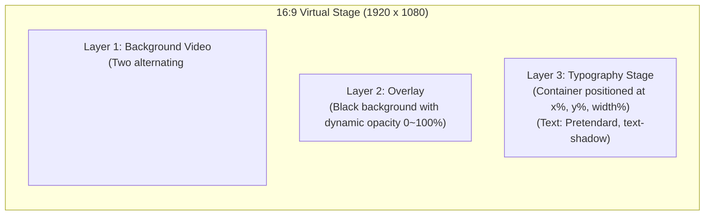
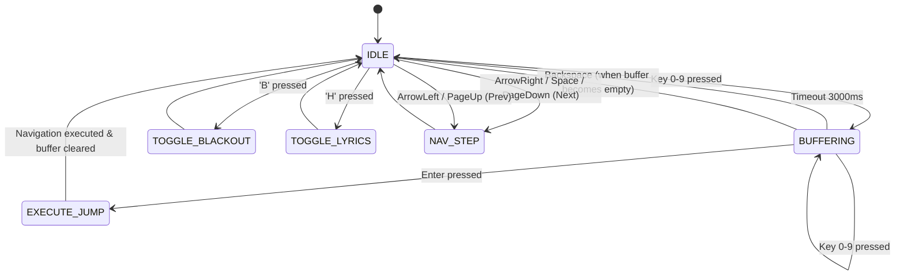

# 기술 디자인 명세서 (Technical Specification)

**문서 버전:** 1.4.0  
**최종 갱신:** 2026-09-24 (사용자 배경 업로드 제거, 관리자 업로드·통합 갤러리)  
**작성자:** Senior Software Architect  
**대상 서비스:** 교회 찬양 슬라이드 제작 및 송출 서비스 (`prj-ppt`)  
**문서 상태:** Approved Design Spec — 일부 항목은 실제 구현과 맞추어 개정됨 (§2.2 구현 현황 참조)

> **1.1.0 개정 요약**
>
> 1. 배경 미디어 전송을 R2 커스텀 도메인 직통에서 **Worker 프록시(`/api/media/*`)** 로 정정했다 (§2.1, §5.4).
> 2. **클라이언트 영속성 3단계(인메모리 → IndexedDB → 서버 동기화)** 를 명시했다 (§5.5).
> 3. 사용자 커스텀 배경 업로드(PRD 4.3)를 데이터 모델과 API 계약에 반영했다 (§4.1, §7.1).
> 4. 각 구성 요소의 구현 여부를 §2.2 표로 명시했다. 설계만 있고 코드가 없는 항목을 구분한다.
>
> **1.2.0 개정 요약**
>
> 1. 클라이언트 영속성 **Phase 2(IndexedDB)를 구현**했다. §2.2·§5.5 상태를 갱신했다.
> 2. `decks` 스토어의 실제 역할(보관함 곡 전용)과 `by-presentation` 인덱스를 두지 않은 이유를 §5.4-4에 명시했다.
> 3. 구 localStorage 보관함(`worship_user_songs_v1`) 마이그레이션 규칙을 §5.5에 추가했다.
>
> **1.3.0 개정 요약 (2026-09-24, 배경 라이브러리)**
>
> 1. `0001_initial`에서 배경 시드 10건을 뺐다. R2에 파일이 없는 행이 깨진 배경을 그렸다. 사전 주입 배경은 R2 업로드 뒤 운영 런북으로 등록한다 (§4.1.1).
> 2. `backgrounds`에 `source`·`owner_user_id`·`kind`·`size_bytes`를 넣고 커스텀 배경 업로드·삭제 API를 구현했다 (§3.3, §4.0-4, §7.1).
> 3. 클라이언트는 배경을 상수가 아니라 **로컬 배경 카탈로그**(IndexedDB `backgrounds` 스토어 + `/api/backgrounds`)로 해석한다. 송출 화면은 로컬 사본만 읽는다 (§5.4-4).
>
> **1.4.0 개정 요약 (2026-09-24, 배경 갤러리)**
>
> 1. 사용자 배경 업로드와 계정 300MB 한도를 없앴다. 배경은 모두 기본 제공 배경(`source='service'`)이고 한 갤러리로 모두에게 보인다 (§4.0-4).
> 2. 업로드·삭제 API는 관리자(`ADMIN_USER_IDS` 시크릿의 user id)만 쓴다. 목록 응답은 `{ backgrounds, canManage }`다 (§7.1).
> 3. `0002_drop_user_backgrounds`가 예전 사용자 업로드 행을 지운다. 컬럼은 남긴다 (§4.1.1).

---

## 1. 개요 및 시스템 목적 (Overview & Architecture Principles)

### 1.1 시스템 목적

본 시스템은 중소형 교회 미디어 봉사자가 찬양 가사와 무음 모션 루프 영상을 결합하여 가독성 높은 16:9 예배용 슬라이드를 15분 이내에 제작하고, 예배 중 인터넷 장애가 발생하더라도 **끊김·검은 화면 없이 100% 오프라인에서 무사고로 송출**할 수 있도록 지원하는 웹 기반 경량 프레젠테이션 플랫폼이다.

### 1.2 핵심 아키텍처 원칙

1. **타입 단일 원천 (Single Source of Truth)**: 모든 도메인 모델, API 계약, 브로드캐스트 메시지, D1 JSON 컬럼 구조는 `src/shared`(`#shared`)의 **Zod 스키마**로 1회 선언하며, TypeScript 타입은 `z.infer`로만 추론한다. 수동 타입 복제는 금지한다.
2. **단방향 의존성 및 레이어 격리** (단일 패키지, 2026-09-24):
   - `src/shared` $\leftarrow$ `src/db` $\leftarrow$ `src/worker`, `src/shared` $\leftarrow$ `src/client` 단방향 참조만 허용하며 ESLint import 규칙으로 강제한다.
   - `src/db`(`#db`)는 Worker 전용 레이어로, 프론트엔드(`src/client`)에서의 임포트는 ESLint로 차단한다.
   - 프론트엔드와 백엔드는 Hono RPC Client (`hc<AppType>`)를 통해서만 타입 안전하게 통신한다.
3. **로컬 우선 영속성과 무결점 오프라인 송출 (Local-First & Zero-Network Presentation)**:
   - 사용자의 작업은 서버가 아니라 **브라우저 로컬 저장소를 1차 원천**으로 삼는다 (§5.5). 로그인은 2026-09-22 결정으로 **편집의 전제 조건**이 되었으나, 세션을 IndexedDB에 캐시해 네트워크가 끊겨도 게이트를 통과한다 — 로그인 때문에 예배 당일 송출이 멈추지 않는다.
   - 예배 중 송출 화면은 API·데이터 요청을 절대 발생시키지 않는다. 네트워크를 쓰는 것은 영상 재생과 배경 백그라운드 캐시뿐이다 (§5.4-3).
   - PWA Service Worker (`RangeRequestsPlugin`)와 `IndexedDB`를 통해 영상 및 세트 데이터를 로컬화한다. 배경 영상은 편집·송출 중에 조용히 캐시된다 (예배 준비 화면은 2026-09-24에 제거).
4. **100ms 이내 결정론적 렌더링 (3-Layer DOM Architecture)**:
   - 캔버스나 무거운 프레임워크(Reveal.js) 대신, 브라우저 가속 DOM 3레이어(Video, Overlay, Text)를 사용하여 프레임 드랍 없이 슬라이드를 즉시 교체한다.
5. **프레젠테이션 간 독립성 보장 (Clone-on-Add)**:
   - 세트에 곡 추가 시 원본 덱을 세트 전용 덱으로 복제(Clone)하여 저장함으로써, 특정 주일의 수정 사항이 과거 프레젠테이션나 개인 라이브러리 원본을 오염시키지 않는다.

---

## 2. 시스템 아키텍처 및 경계 다이어그램 (System Architecture & Boundaries)

### 2.1 C4 컨테이너 다이어그램 (System Containers)

```mermaid
flowchart TB
  subgraph Client["Client Browser (Google Chrome Dedicated)"]
    subgraph FrontendSPA["React SPA (src/client)"]
      UI["Editor / Presentation UI (shadcn/ui + Tailwind)"]
      StageRenderer["3-Layer Slide Stage"]
      AudienceDisplay["Fullscreen Projection View"]
      InputBuffer["Numeric Keypad Buffer Engine"]
    end

    subgraph BrowserStorage["Offline Storage Layer"]
      SW["Service Worker (Workbox + RangeRequests)"]
      CacheStorage["Cache Storage (App Shell, Fonts, R2 MP4)"]
      IDB[("IndexedDB (idb: Active Sets & Decks)")]
    end

    AudienceDisplay --> StageRenderer
    StageRenderer <--> IDB
    SW <--> CacheStorage
  end

  subgraph CloudflarePlatform["Cloudflare Serverless Platform"]
    subgraph EdgeWorker["Cloudflare Worker (src/worker)"]
      HonoAPI["Hono REST API (/api/*)"]
      AuthMiddleware["Better Auth Session Guard"]
    end

    subgraph StorageServices["Storage & Data"]
      D1DB[("Cloudflare D1 (SQLite + FTS5)")]
      R2Media[("Cloudflare R2 Bucket (Loop Videos + User Uploads)")]
    end
  end

  UI -->|Hono RPC (/api/*)| HonoAPI
  HonoAPI --> AuthMiddleware
  AuthMiddleware --> D1DB

  MediaProxy["Media Proxy (/api/media/* · HTTP Range)"]
  HonoAPI --> MediaProxy
  MediaProxy --> R2Media
  BrowserStorage <-->|HTTP Range Partial Get (same-origin)| MediaProxy
```

배경 영상은 R2 커스텀 도메인 직통이 아니라 **같은 Worker의 `/api/media/*` 프록시**를 통해 전달한다. 동일 출처이므로 R2 CORS 설정이 필요 없고, Service Worker 캐시 규칙도 자체 오리진 경로 하나로 끝난다. 대신 영상 트래픽이 Worker 요청 수·CPU 시간에 계상되므로, 사용량이 커지면 커스텀 도메인 직통으로 되돌리는 선택지를 남겨 둔다. 그때 바뀌는 것은 URL 생성 헬퍼(`mediaUrlForKey`·`MEDIA_URL_PREFIX`)와 Workbox `urlPattern` 두 곳뿐이다.

### 2.2 구현 현황 스냅샷 (2026-09-24)

본 명세의 항목 중 실제 코드가 있는 것과 설계만 있는 것을 구분한다. 이 표를 갱신하지 않은 채 "스펙에 있으니 구현되어 있다"고 가정하지 않는다.

| 구성 요소                                 | 상태 | 비고                                                                                                             |
| ----------------------------------------- | ---- | ---------------------------------------------------------------------------------------------------------------- |
| `src/shared` Zod 스키마 (§3)              | 구현 | Deck·Slide·Style·Presentation·API·공유 라이브러리(`library.ts`) 계약                                             |
| `src/db` Drizzle 스키마·`migrations/`(§4) | 구현 | `0001_initial` 하나. 첫 배포 전 0000~0008을 합쳤다 (2026-09-24). 다음 마이그레이션은 0002부터                    |
| 스코프 쿼리 헬퍼 (§4.3)                   | 구현 | decks·presentations·search·sharing·reports. 공개 조건은 `publicDeckCondition()` 한 곳                            |
| 3-Layer Slide Stage (§5.1)                | 구현 | `components/stage/*` — 편집기와 송출이 동일 컴포넌트 사용                                                        |
| 입력 버퍼 엔진·단축키 (§5.2)              | 구현 | `useNavigationBuffer`, `usePresentationShortcuts` (tinykeys)                                                     |
| 세트 편집기 (PRD 4.4)                     | 구현 | 넘침 경고와 커서 기준 분할·합치기 구현 (M2). 공개·비공개는 곡 추가 창 내 보관함 미리보기로 옮겼다 (2026-09-25)   |
| 미디어 프록시 `/api/media/*` (§5.4)       | 구현 | HTTP Range 지원                                                                                                  |
| 클라이언트 영속성 (§5.5)                  | 구현 | IndexedDB가 1차 원천. 프레젠테이션과 **보관함 곡** 모두 서버와 동기화 (보관함은 M5-2에서 연결)                   |
| Hono RPC 클라이언트 (`hc<AppType>`)       | 구현 | `AppType = ReturnType<typeof createApp>`. 라우트는 팩토리(`createApp(deps)`)라 테스트가 실제 라우트를 마운트한다 |
| Better Auth (§4.1 auth 테이블)            | 구현 | 카카오·네이버 + localhost 전용 개발자 로그인. 실제 OAuth 자격증명 확인은 대기                                    |
| 발표자 보기·BroadcastChannel (§5.3)       | 제거 | MVP 범위에서 제외 (2026-09-24). 송출은 전체화면 `/present/:id/fullscreen` 한 가지                                |
| PWA·Cache Storage (§5.4)                  | 구현 | vite-plugin-pwa(generateSW) + RangeRequests (M4)                                                                 |
| TanStack Query (서버 캐시)                | 구현 | 곡 추가 모달의 공유 검색·상세·가져오기, 공개 전환, 신고에만 쓴다. 송출 화면 import는 ESLint가 막는다 (M5-5)      |
| 가사 라이브러리·LLM 정규화 (§6)           | 제거 | MVP 범위에서 제외 (2026-09-23). 테이블은 스키마에서 지웠다                                                       |
| 공유 라이브러리 API (§7)                  | 구현 | 공개 전환·검색(가져간 횟수순 게시판)·상세·가져오기·신고 (M5-3)                                                   |
| 운영자 도구                               | 구현 | 관리자 화면 없음. `docs/ops/moderation-runbook.md`의 SQL (`src/db/ops/moderationSql.ts`가 정본)                  |
| 관리자 배경 업로드 (PRD 4.3)              | 구현 | 배경 갤러리에서 관리자만 올리기·지우기 (MP4·JPEG·PNG·WebP, 파일당 30MB, 출처·라이선스 입력). 사용자 업로드 없음  |
| 저장 실패 경고 배너                       | 구현 | `StorageWarningBanner` — 용량 초과와 저장소 차단을 구분, 닫을 수 없음                                            |

---

## 3. src/shared: 도메인 모델 및 Zod 스키마 명세

`src/shared`(`#shared`)는 브라우저와 Cloudflare Worker 양쪽에서 실행되는 순수 TypeScript 레이어이다.

**엔터티 id (2026-09-24, UUID → NanoID):** 사용자·세션·덱·프레젠테이션·항목·신고·배경 id는 모두 21자 NanoID(`[A-Za-z0-9_-]{21}`)다. 형식은 `schemas/id.ts`의 `IdSchema` 하나로 검증하고, 새 id는 `utils/id.ts`의 `createId()`로만 만든다 (Worker의 Better Auth `generateId`, D1 쿼리 헬퍼, 클라이언트 스토어 모두). `crypto.randomUUID()`는 ESLint(`no-restricted-properties`)가 막는다. 옛 UUID는 호환하지 않는다: 스키마가 거부하고, 로컬 IndexedDB는 v3 업그레이드가 비운다(§5.4-4). D1은 첫 배포 전이라 `0001_initial` 하나로 새로 만든다(§4.1.1).

### 3.1 슬라이드 및 스타일 기본 스키마 (`schemas/style.ts`, `schemas/slide.ts`)

```typescript
import { z } from "zod";

/**
 * 3x3 격자 앵커 프리셋
 */
export const GridAnchorPresetSchema = z.enum([
  "top-left",
  "top-center",
  "top-right",
  "middle-left",
  "middle-center",
  "middle-right",
  "bottom-left",
  "bottom-center",
  "bottom-right",
  "custom",
]);
export type GridAnchorPreset = z.infer<typeof GridAnchorPresetSchema>;

/**
 * 슬라이드 텍스트 박스 위치 및 크기 (%)
 * 16:9 가상 스테이지(1920x1080) 기준 퍼센트 (0 ~ 100)
 */
export const TextBoxPositionSchema = z.object({
  anchor: GridAnchorPresetSchema.default("middle-center"),
  xPercent: z.number().min(5).max(95).default(50), // 앵커 X 좌표
  yPercent: z.number().min(5).max(95).default(50), // 앵커 Y 좌표
  widthPercent: z.number().min(20).max(90).default(80), // 텍스트 박스 최대 가로폭
});
export type TextBoxPosition = z.infer<typeof TextBoxPositionSchema>;

/**
 * 곡(Deck) 단위 타이포그래피 및 가독성 스타일
 */
export const DeckStyleSchema = z.object({
  // 오버레이 설정
  overlayOpacity: z.number().min(0).max(100).default(40), // 0 ~ 100%
  overlayColor: z
    .string()
    .regex(/^#([0-9a-fA-F]{3}){1,2}$/)
    .default("#000000"),

  // 폰트 및 텍스트 설정
  fontFamily: z
    .enum([
      "Pretendard",
      "Noto Sans KR",
      "Nanum Myeongjo",
      "Gmarket Sans",
      "KoPubWorld Batang",
    ])
    .default("Pretendard"),
  fontSizeVw: z.number().min(2).max(10).default(4.2), // 16:9 기준 상대 폰트 크기
  fontColor: z
    .string()
    .regex(/^#([0-9a-fA-F]{3}){1,2}$/)
    .default("#FFFFFF"),
  textAlign: z.enum(["left", "center", "right"]).default("center"),
  lineHeight: z.number().min(1.0).max(2.5).default(1.4),

  // 그림자 (가독성 핵심)
  textShadowLevel: z
    .enum(["none", "soft", "medium", "strong"])
    .default("medium"),

  // 텍스트 박스 위치
  position: TextBoxPositionSchema.default({
    anchor: "middle-center",
    xPercent: 50,
    yPercent: 50,
    widthPercent: 80,
  }),
});
export type DeckStyle = z.infer<typeof DeckStyleSchema>;

/**
 * 슬라이드 1장 데이터 (경량화 ID 및 최대 4줄 제약)
 */
export const SlideSchema = z.object({
  id: z
    .string()
    .min(1)
    .default(() => `s_${Math.random().toString(36).substring(2, 9)}`),
  order: z.number().int().nonnegative(),
  lines: z.array(z.string().max(80)).max(4), // 슬라이드당 최대 4줄 제약 (PRD 4.2)
});
export type Slide = z.infer<typeof SlideSchema>;
```

### 3.2 덱(Deck) 및 프레젠테이션(Presentation) 스키마 (`schemas/deck.ts`, `schemas/presentation.ts`)

```typescript
import { z } from "zod";
import { IdSchema } from "./id";
import { SlideSchema } from "./slide";
import { DeckStyleSchema } from "./style";

export const DeckVisibilitySchema = z.enum(["private", "public"]);
export type DeckVisibility = z.infer<typeof DeckVisibilitySchema>;

/**
 * 덱 스코프: 라이브러리 마스터 덱 vs 프레젠테이션 복제 전용 덱
 */
export const DeckScopeSchema = z.enum(["library", "presentation"]);
export type DeckScope = z.infer<typeof DeckScopeSchema>;

export const DeckSchema = z.object({
  id: IdSchema,
  userId: IdSchema,
  scope: DeckScopeSchema.default("library"), // 'library': 보관함 마스터, 'presentation': 프레젠테이션 전용 복제본
  presentationId: IdSchema.nullable().optional(), // scope='presentation'일 때 속한 프레젠테이션 ID
  title: z.string().min(1).max(100),
  artist: z.string().max(100).default(""),
  lyricsRaw: z.string(),
  slides: z.array(SlideSchema),
  backgroundId: IdSchema.nullable(),
  style: DeckStyleSchema,
  visibility: DeckVisibilitySchema.default("private"),
  forkedFrom: IdSchema.nullable().optional(), // 원본 덱 ID (Clone/Fork 출처 추적)
  forkCount: z.number().int().nonnegative().default(0),
  createdAt: z.string().datetime(),
  updatedAt: z.string().datetime(),
});
export type Deck = z.infer<typeof DeckSchema>;

export const PresentationItemSchema = z.object({
  id: IdSchema,
  presentationId: IdSchema,
  deckId: IdSchema,
  order: z.number().int().nonnegative(),
  deck: DeckSchema.optional(), // Hydrated relation
});
export type PresentationItem = z.infer<typeof PresentationItemSchema>;

export const PresentationSchema = z.object({
  id: IdSchema,
  userId: IdSchema,
  title: z.string().min(1).max(100),
  serviceDate: z.string().regex(/^\d{4}-\d{2}-\d{2}$/), // YYYY-MM-DD
  items: z.array(PresentationItemSchema).default([]),
  createdAt: z.string().datetime(),
  updatedAt: z.string().datetime(),
});
export type Presentation = z.infer<typeof PresentationSchema>;
```

### 3.3 배경 미디어 스키마 (`schemas/media.ts`)

```typescript
export const BackgroundMediaSchema = z.object({
  id: IdSchema,
  title: z.string().min(1).max(100),
  source: z.enum(["service", "user"]), // 앱은 service만 내보낸다 ('user'는 없앤 업로드의 흔적)
  kind: z.enum(["video", "image"]),
  mediaUrl: z.string().startsWith(MEDIA_URL_PREFIX), // /api/media/<r2Key>
  posterUrl: z.string().startsWith(MEDIA_URL_PREFIX), // 이미지는 mediaUrl과 같다
  durationSec: z.number().int().nonnegative(), // 이미지는 0
  sizeBytes: z.number().int().nonnegative(),
  license: z.string(),
  tags: BackgroundTagsSchema, // ["잔잔한", "따뜻한"]
  createdAt: z.string().datetime(),
});
```

- URL은 동일 출처 프록시 상대 경로다. 커스텀 도메인 절대 URL(`cdnUrl`)과 `R2_PUBLIC_DOMAIN`은 쓰지 않아 제거했다.
- 목록 응답은 `BackgroundListResponseSchema` (`{ backgrounds, canManage }`, 관리자일 때만 `canManage: true`)다.
- 업로드 폼(관리자 전용)은 `BackgroundUploadFormSchema`(multipart: `file`, 영상이면 필수인 `poster`, `title`, `license`, `tags` JSON, `durationSec`, `acceptedRightsNotice: "true"`)다. 크기·선언 MIME은 스키마가, 실제 형식(파일 앞부분 바이트)은 Worker가 `sniffBackgroundMimeType`으로 확인한다.
- 한도와 형식은 `constants/backgrounds.ts`의 `BACKGROUND_UPLOAD_LIMITS` 하나를 클라이언트 사전 검사와 Worker가 함께 본다.

### 3.4 BroadcastChannel 동기화 프로토콜 — 제거

**2026-09-24 결정으로 발표자 보기와 함께 제거했다.** `schemas/broadcast.ts`(`BroadcastMessageSchema`)와 `PROJECTION_CHANNEL_NAME`·`PROJECTION_SYNC`·`AUDIENCE_*` 상수가 없다. 송출은 한 창에서 하므로 창 사이 동기화 계약이 필요 없다.

---

## 4. 데이터베이스 아키텍처 및 Drizzle/D1 스키마 (`src/db`)

Cloudflare D1(SQLite)을 영속성 엔진으로 사용하며, Drizzle ORM을 통해 마이그레이션과 질의를 관리한다.

### 4.0 스키마 비판적 검증 및 정규화 분석 (Critical Schema Audit & Normalization)

소프트웨어 아키텍트 관점에서 D1 SQLite의 제약사항(분산 SQLite, 파일 크기 한계, RLS 부재)과 PRD의 비기능 제약(100ms 반응성, 무결점 오프라인)을 만족시키기 위해 다음 6가지 핵심 항목에 대한 비판적 검증과 스키마 최적화를 단행한다.

#### 1. Clone-on-Add 방식의 정규화 최적화 (고아 데이터 방지 및 라이브러리 격리)

- **문제점**: 프레젠테이션(Presentation)에 곡을 추가할 때 덱을 복제하면, `decks` 테이블에 수백 개의 복제 행이 누적된다.
  1. `userId`로 덱을 단순 조회하면 과거 프레젠테이션의 복제본들이 '내 라이브러리'에 중복 노출되어 UI가 오염된다.
  2. 프레젠테이션(`presentations`) 삭제 시 `presentation_items`는 지워지지만 복제된 `decks` 행은 참조가 끊긴 채 **영구 고아 데이터(Orphaned Row)**로 남아 D1 저장 공간을 낭비한다.
- **최적화 설계**:
  - `decks` 테이블에 `scope: 'library' | 'presentation'`와 `presentation_id` 외래키를 추가한다.
  - 라이브러리 덱은 `scope = 'library', presentation_id = null`로 유지되고, 세트 복제본은 `scope = 'presentation', presentation_id = presentation.id`로 명확히 격리된다.
  - `presentation_id`에 `ON DELETE CASCADE`를 설정하여 프레젠테이션 삭제 시 종속된 복제 덱들이 데이터베이스 엔진 레벨에서 원자적으로 함께 삭제되도록 무결성을 보장한다.
  - 인덱스 `(user_id, scope)`를 구성하여 라이브러리 조회(`scope = 'library'`)의 인덱스 풀 스캔을 보장한다.
- **구현 상태 (2026-09-22)**: 클라이언트의 `addDeckToPresentation`이 곡을 담을 때 항상 새 id(`createId()`)·세션 `userId`·`scope: 'presentation'`·활성 문서 `presentationId`로 복제한다. 그전까지는 복제 없이 원본 덱을 그대로 넣어, 같은 공유 곡을 두 번 담으면 `decks` 기본키와 `presentation_items`의 `unique(presentation_id, deck_id)`를 동시에 위반해 **세트 전체가 서버에 저장되지 않았다.** 그 시절 저장된 중복 문서는 하이드레이션에서 새 id를 발급해 복구한다.

#### 2. JSON TEXT 컬럼 반정규화(Pragmatic Denormalization)의 타당성

- **검증**: `decks.slides`와 `decks.style`을 관계형 정규화(1NF)하여 별도의 `slides` 테이블로 분리할 것인가?
- **결론**: **JSON TEXT 유지 (실용적 반정규화 채택)**.
  - 예배 송출 시 슬라이드는 개별 행으로 검색되지 않으며, 항상 곡 단위의 원자적(Atomic) 문서로 소비된다.
  - 1개 프레젠테이션(5곡 × 평균 15슬라이드 = 75행)를 로드할 때 RDB 조인(JOIN) 연산을 발생시키는 대신, 단일 SELECT 쿼리로 100ms 이내에 즉각 응답하는 것이 PRD의 성능 목표(6.2)에 부합한다.
  - 내부 무결성은 애플리케이션 계층에서 `SlideSchema.array()` 및 `DeckStyleSchema`로 100% 검증한다. 슬라이드 ID는 덱 안에서만 쓰이므로 엔터티 id(21자 NanoID)보다 짧은 경량 ID(`s_` + 10자 NanoID, `createSlideId()`)를 채택하여 JSON 페이로드 크기를 절감한다.

#### 3. Better Auth v1 공식 스키마 정규화 완결성

- **검증**: Better Auth의 Drizzle D1 어댑터가 요구하는 필수 필드(`emailVerified`, `session.ipAddress`, `session.userAgent`, `account.scope`, `account.idToken`, `verification` 테이블)가 누락되면 인스턴스 초기화 시 런타임 스키마 에러가 발생한다.
- **최적화 설계**: Better Auth v1 공식 규격의 컬럼과 테이블을 완벽히 매핑하여 인증 호환성을 보장한다.

#### 4. 배경 갤러리와 관리자 업로드 (PRD 4.3, 2026-09-24 개정)

- **설계**: 배경은 모두 기본 제공 배경(`source='service'`)이다. 목록은 누구에게나 같고(`listBackgrounds`), 공개 덱·포크에도 배경이 따라간다.
  - 업로드·삭제는 `requireAuth` 뒤의 `requireAdmin`이 막는다. 관리자는 `ADMIN_USER_IDS` 시크릿의 user id로 가린다. 카카오·비밀번호 계정의 이메일은 검증되지 않아 이메일로는 가리지 않는다.
  - 목록 응답의 `canManage`는 화면에서 버튼을 보일지 정하는 데만 쓴다. 권한 검사는 서버가 한다.
  - 동기화(`PUT /api/decks/:id`, `PUT /api/presentations/:id`)와 공개 경로(검색·상세·포크)는 기본 제공 배경이 아닌 `backgroundId`를 `null`로 낮춘다 (`nullifyUnknownBackgrounds(db, rows)`). 예전 사용자 업로드 행이 남아 있어도 어떤 경로로도 나가지 않는다.
  - 미디어 프록시(`/api/media/*`)는 인증 없이 서빙한다. 세션을 검사하면 송출 중 세션이 만료되는 순간 배경이 꺼진다.
- **용량 한도**: 계정별 총량 한도는 없다. 파일당 30MB는 Worker가 요청 본문을 한 번에 받기 때문에 남긴다 (PRD 6.3).

---

### 4.1 테이블 명세 및 최적화된 Drizzle 스키마 정의 (`schema/*.ts`)

```typescript
import {
  sqliteTable,
  text,
  integer,
  index,
  uniqueIndex,
} from "drizzle-orm/sqlite-core";
import { sql } from "drizzle-orm";

// ============================================================================
// 1. Better Auth v1 공식 완결 스키마 (OAuth 카카오/네이버)
// ============================================================================
export const user = sqliteTable("user", {
  id: text("id").primaryKey(),
  name: text("name").notNull(),
  email: text("email"), // 카카오 기본 권한 시 null 허용
  emailVerified: integer("email_verified", { mode: "boolean" })
    .notNull()
    .default(false),
  image: text("image"),
  createdAt: integer("created_at", { mode: "timestamp" }).notNull(),
  updatedAt: integer("updated_at", { mode: "timestamp" }).notNull(),
});

export const session = sqliteTable("session", {
  id: text("id").primaryKey(),
  userId: text("user_id")
    .notNull()
    .references(() => user.id, { onDelete: "cascade" }),
  token: text("token").notNull().unique(),
  expiresAt: integer("expires_at", { mode: "timestamp" }).notNull(),
  ipAddress: text("ip_address"),
  userAgent: text("user_agent"),
  createdAt: integer("created_at", { mode: "timestamp" }).notNull(),
  updatedAt: integer("updated_at", { mode: "timestamp" }).notNull(),
});

export const account = sqliteTable("account", {
  id: text("id").primaryKey(),
  userId: text("user_id")
    .notNull()
    .references(() => user.id, { onDelete: "cascade" }),
  accountId: text("account_id").notNull(),
  providerId: text("provider_id").notNull(), // 'kakao' | 'naver'
  accessToken: text("access_token"),
  refreshToken: text("refresh_token"),
  accessTokenExpiresAt: integer("access_token_expires_at", {
    mode: "timestamp",
  }),
  refreshTokenExpiresAt: integer("refresh_token_expires_at", {
    mode: "timestamp",
  }),
  scope: text("scope"),
  idToken: text("id_token"),
  password: text("password"),
  createdAt: integer("created_at", { mode: "timestamp" }).notNull(),
  updatedAt: integer("updated_at", { mode: "timestamp" }).notNull(),
});

export const verification = sqliteTable("verification", {
  id: text("id").primaryKey(),
  identifier: text("identifier").notNull(),
  value: text("value").notNull(),
  expiresAt: integer("expires_at", { mode: "timestamp" }).notNull(),
  createdAt: integer("created_at", { mode: "timestamp" }).notNull(),
  updatedAt: integer("updated_at", { mode: "timestamp" }).notNull(),
});

// ============================================================================
// 3. 배경 영상 메타데이터
// ============================================================================
export const backgrounds = sqliteTable(
  "backgrounds",
  {
    id: text("id").primaryKey(),
    title: text("title").notNull(),
    r2Key: text("r2_key").notNull(),
    posterKey: text("poster_key").notNull(),
    durationSec: integer("duration_sec").notNull(),
    license: text("license").notNull(),
    tags: text("tags").notNull(), // JSON TEXT: string[]

    // 없앤 사용자 업로드의 흔적 (행은 0002에서 삭제, 컬럼은 부모 테이블 재생성을 피하려고 남김)
    source: text("source", { enum: ["service", "user"] })
      .notNull()
      .default("service"),
    ownerUserId: text("owner_user_id").references(() => user.id, {
      onDelete: "cascade",
    }), // source='user'일 때만 채워진다
    kind: text("kind", { enum: ["video", "image"] })
      .notNull()
      .default("video"),
    sizeBytes: integer("size_bytes").notNull().default(0), // 영상 + 포스터 크기

    createdAt: integer("created_at", { mode: "timestamp" }).default(
      sql`(unixepoch())`,
    ),
  },
  (t) => [
    // 사전 주입 목록 조회(source='service')와 내 업로드 조회를 각각 인덱스로 받는다
    index("idx_backgrounds_source").on(t.source),
    index("idx_backgrounds_owner").on(t.ownerUserId),
  ],
);

// ============================================================================
// 4. 덱 (Deck) - 찬양 1곡 단위 (라이브러리 마스터 vs 프레젠테이션 복제 격리)
// ============================================================================
export const decks = sqliteTable(
  "decks",
  {
    id: text("id").primaryKey(),
    userId: text("user_id")
      .notNull()
      .references(() => user.id, { onDelete: "cascade" }),

    // 스코프 격리 및 프레젠테이션 종속성
    scope: text("scope", { enum: ["library", "presentation"] })
      .notNull()
      .default("library"),
    presentationId: text("presentation_id").references(() => presentations.id, {
      onDelete: "cascade",
    }),

    title: text("title").notNull(),
    artist: text("artist").default(""),
    lyricsRaw: text("lyrics_raw").notNull(),
    slides: text("slides").notNull(), // JSON TEXT: Slide[]
    backgroundId: text("background_id").references(() => backgrounds.id, {
      onDelete: "set null",
    }),
    style: text("style").notNull(), // JSON TEXT: DeckStyle

    visibility: text("visibility", { enum: ["private", "public"] })
      .notNull()
      .default("private"),
    forkedFrom: text("forked_from"), // 원본 덱 ID (Clone-on-Add 또는 Fork 출처)
    forkCount: integer("fork_count").notNull().default(0),

    createdAt: integer("created_at", { mode: "timestamp" }).default(
      sql`(unixepoch())`,
    ),
    updatedAt: integer("updated_at", { mode: "timestamp" }).default(
      sql`(unixepoch())`,
    ),
  },
  (t) => [
    index("idx_decks_user_scope").on(t.userId, t.scope), // 내 보관함 필터링 최적화
    index("idx_decks_presentation").on(t.presentationId), // 세트 종속 덱 조회
    index("idx_decks_visibility_forks").on(t.visibility, t.forkCount),
  ],
);

// ============================================================================
// 5. 예배 프레젠테이션 (Presentation) 및 항목
// ============================================================================
export const presentations = sqliteTable(
  "presentations",
  {
    id: text("id").primaryKey(),
    userId: text("user_id")
      .notNull()
      .references(() => user.id, { onDelete: "cascade" }),
    title: text("title").notNull(),
    serviceDate: text("service_date").notNull(), // 'YYYY-MM-DD'
    createdAt: integer("created_at", { mode: "timestamp" }).default(
      sql`(unixepoch())`,
    ),
    updatedAt: integer("updated_at", { mode: "timestamp" }).default(
      sql`(unixepoch())`,
    ),
  },
  (t) => [index("idx_presentations_user_date").on(t.userId, t.serviceDate)],
);

export const presentationItems = sqliteTable(
  "presentation_items",
  {
    id: text("id").primaryKey(),
    presentationId: text("presentation_id")
      .notNull()
      .references(() => presentations.id, { onDelete: "cascade" }),
    deckId: text("deck_id")
      .notNull()
      .references(() => decks.id, { onDelete: "cascade" }),
    order: integer("order").notNull(),
  },
  (t) => [
    index("idx_presentation_items_order").on(t.presentationId, t.order),
    uniqueIndex("idx_presentation_items_unique").on(t.presentationId, t.deckId),
  ],
);

// ============================================================================
// 6. 오류 신고 및 저작권 요청
// ============================================================================
export const reports = sqliteTable("reports", {
  id: text("id").primaryKey(),
  userId: text("user_id").references(() => user.id),
  targetType: text("target_type", { enum: ["deck"] }).notNull(),
  targetId: text("target_id").notNull(),
  reason: text("reason").notNull(),
  status: text("status", { enum: ["pending", "resolved", "rejected"] }).default(
    "pending",
  ),
  createdAt: integer("created_at", { mode: "timestamp" }).default(
    sql`(unixepoch())`,
  ),
});
```

### 4.1.1 배경 행은 마이그레이션에 넣지 않는다 (`migrations/0001_initial.sql`)

첫 배포 전인 2026-09-24에 UUID 시드·NanoID 초기화·NanoID 재시드를 포함한 0000~0008을 `0001_initial.sql` 하나로 합쳤다. 저널 idx를 1로 두어 다음 `db:generate`는 0002부터 번호를 매긴다. 옛 0000~0008을 적용한 D1(로컬 `.wrangler` 상태 포함)은 새로 만들어야 한다.

같은 날 `0001`을 한 번 더 고쳤다. 사전 주입 배경 시드 10건을 빼고 `backgrounds`에 `source`·`owner_user_id`·`kind`·`size_bytes`와 인덱스 둘을 넣었다. 시드가 가리키던 `loops/*.mp4`·`posters/*.webp`는 R2에 올라간 적이 없어, 편집기·송출이 404 배경을 그렸다. 고치기 전 `0001`을 적용한 D1도 새로 만든다.

- **배경 행은 R2 객체가 올라간 뒤에만 만든다.** 사전 주입 배경은 `docs/ops/background-runbook.md` 절차(R2 `object put` → D1 `INSERT`)로 등록한다. 문장의 정본은 `src/db/ops/backgroundSql.ts`이고, `backgroundSql.test.ts`가 실제 스키마에 대해 실행하며 `runbook.test.ts`가 문서와 대조한다. `tests/migrations.test.ts`는 `0001`에 배경 `INSERT`가 다시 들어오지 못하게 막는다.
- 관리자 앱 업로드는 R2에 먼저 쓰고 D1 행을 나중에 만든다. 행 삽입이 실패하면 올린 객체를 지운다.
- `0002_drop_user_backgrounds`는 `DELETE FROM backgrounds WHERE source = 'user'` 한 문장이다. `backgrounds`는 `decks`의 부모 테이블이라 다시 만들지 않고, `owner_user_id`는 외래키라 `DROP COLUMN`이 되지 않아 컬럼은 남긴다.
- 서버는 기본 제공 배경이 아닌 `backgroundId`를 `null`로 낮춰 받는다(`nullifyUnknownBackgrounds`). `decks.background_id` 외래키를 D1이 강제하므로, 모르는 id 하나가 `db.batch()` 전체를 롤백시켜 세트를 통째로 잃는 사고(2026-09-22 실제 발생)를 막는다. 배경은 장식이고 가사는 봉사자의 작업물이다.

### 4.2 FTS5 Trigram 검색 가상 테이블 (`migrations/0001_initial.sql`)

공개 덱 검색용 FTS5 Trigram 인덱스다. drizzle-kit 생성본 뒤에 가상 테이블과 트리거를 손으로 덧붙였다.

- **색인 조건 = 공개 조건**: `scope = 'library' AND visibility = 'public' AND takedown_at IS NULL`. M5 이전에는 `visibility`만 봐서, 공개 샘플 곡을 세트에 담은 복제본까지 공개 검색에 섞였다. 이 조건은 쿼리 헬퍼의 `publicDeckCondition()`과 같다. 둘 중 하나만 바꾸지 않는다.
- **가사 본문도 색인한다** (`decks_fts.lyrics`). 곡 추가 모달이 공유 곡도 가사로 찾는다 (PRD 4.7 괄호 문단).
- **갱신 트리거는 하나**: '빼고 → 넣기'를 한 트리거 안에서 한다. 둘로 나누면 SQLite가 나중에 만든 트리거를 먼저 실행해 방금 넣은 행을 지운다.
- **색인 대상이었던 행에만 FTS를 건드린다**: 세트 동기화는 덱을 매번 지우고 다시 넣는다. 조건 없는 트리거는 곡마다 FTS를 훑는다. `rowid` 연결은 쓰지 않는다 (TEXT 기본키 테이블의 rowid는 VACUUM에서 바뀔 수 있다).
- drizzle-kit이 `decks_fts`를 일반 테이블로 알고 있어 `db:generate`가 FTS 테이블에 `ALTER`를 만든다. 생성된 마이그레이션에서 `_fts` 문장은 지우고 FTS는 손으로 쓴 SQL로만 다룬다.

검색 헬퍼(`queries/search.ts`)는 검색어를 **토큰 단위로** 나눈다. 3자 이상 토큰은 `MATCH`, 2자 이하 토큰은 `LIKE '%t%' ESCAPE '\'`로 보내고 모두 AND로 묶는다. 문자열 전체 길이로 분기하면 "주 은혜로"처럼 짧은 토큰이 섞인 검색이 `MATCH`로 가서 아무것도 찾지 못한다. 빈 검색어는 가져간 횟수순 둘러보기다.

### 4.3 D1 보안 가드레일: 중앙 집중식 스코프 쿼리 헬퍼 (`queries/*.ts`)

D1에는 Postgres RLS가 없으므로 애플리케이션 계층에서 `userId` 및 `visibility`를 엄격히 강제한다.

> **M5 구현 메모 (2026-09-23)** — 아래 코드는 설계 당시의 모양이다. 실제 헬퍼와 다른 점:
>
> - **서버 소유 공유 필드**: `upsertDeck`은 `visibility`·`forkCount`·`origin`·`forkedFrom`·`forkedFromAuthorName`·`publishedAt`·`takedownAt`을 기존 행 값으로 유지하고, 새 행이면 비공개·0회·`origin='user'`로 만든다. `scope='library'`를 강제한다. 세트 문서(`fromPresentationDocument`)는 복제본을 항상 비공개·0회로 쓴다. 이 값을 바꾸는 경로는 공개 전환(`setDeckVisibility`)·가져오기(`forkPublicDeck`)·게시 중단(운영 런북)뿐이다.
> - **공개 조건 `publicDeckCondition()`** (`queries/publicScope.ts`): 보관함 덱 + 공개 + 게시 중단 아님. 검색·상세·가져오기·신고가 모두 이 조건을 쓴다.
> - 검색 헬퍼는 `queries/search.ts`로 옮겼다 (§4.2).

```typescript
// src/db/queries/decks.ts
import { eq, and, desc, sql } from "drizzle-orm";
import { db } from "../client";
import { decks, decksFts } from "../schema";

/**
 * FTS5 쿼리 새니타이저
 * 특수문자 및 FTS5 제어 연산자(AND, OR, NOT, NEAR, *, (), ") 주입 공격 방지
 */
export function sanitizeFts5Query(query: string): string {
  // 영문/한글/숫자/공백만 남기고 모든 특수기호 제거
  const cleaned = query.replace(/[^\p{L}\p{N}\s]/gu, " ").trim();
  const tokens = cleaned.split(/\s+/).filter(Boolean);
  if (tokens.length === 0) return "";
  // 각 토큰을 큰따옴표로 감싸 안전한 MATCH 구문 생성: "은혜로운" "찬양"
  return tokens.map((t) => `"${t}"`).join(" ");
}

export const deckQueries = {
  // 1. 사용자 본인 소유 '내 라이브러리' 마스터 덱 목록 조회 (프레젠테이션 복제본 제외)
  async getMyLibraryDecks(userId: string) {
    return db
      .select()
      .from(decks)
      .where(
        and(
          eq(decks.userId, userId),
          eq(decks.scope, "library"), // 프레젠테이션용 복제 덱 필터링 (UI 오염 방지)
        ),
      )
      .orderBy(desc(decks.updatedAt));
  },

  // 2. 사용자 본인 소유 덱 단건 조회
  async getByIdScoped(deckId: string, userId: string) {
    const [result] = await db
      .select()
      .from(decks)
      .where(and(eq(decks.id, deckId), eq(decks.userId, userId)));
    return result ?? null;
  },

  // 3. 공개 덱 안전 조회 (비공개 덱 유출 원천 차단)
  async getPublicById(deckId: string) {
    const [result] = await db
      .select()
      .from(decks)
      .where(and(eq(decks.id, deckId), eq(decks.visibility, "public")));
    return result ?? null;
  },

  // 4. FTS5 Trigram + LIKE 하이브리드 고속 검색 (새니타이징 적용)
  async searchPublicDecks(query: string, limit = 20) {
    const trimmed = query.trim();
    if (!trimmed) return [];

    if (trimmed.length >= 3) {
      const sanitizedFts = sanitizeFts5Query(trimmed);
      if (!sanitizedFts) return [];

      // 3자 이상: FTS5 Trigram MATCH 쿼리
      return db
        .select({ deck: decks })
        .from(decks)
        .innerJoin(decksFts, eq(decks.id, decksFts.deckId))
        .where(
          and(
            eq(decks.visibility, "public"),
            sql`decks_fts MATCH ${sanitizedFts}`,
          ),
        )
        .orderBy(desc(decks.forkCount))
        .limit(limit);
    } else {
      // 2자 이하: LIKE 쿼리 안전 폴백
      return db
        .select()
        .from(decks)
        .where(
          and(
            eq(decks.visibility, "public"),
            sql`(${decks.title} LIKE ${`%${trimmed}%`} OR ${decks.artist} LIKE ${`%${trimmed}%`})`,
          ),
        )
        .orderBy(desc(decks.forkCount))
        .limit(limit);
    }
  },
};
```

---

## 5. 비기능 요구사항 충족을 위한 렌더링 & 상태 관리 아키텍처

### 5.1 3-Layer Slide Stage 렌더링 엔진

프레젠테이션 및 편집기 미리보기는 **16:9 고정 가상 캔버스 (1920x1080)** 로 렌더링되며, 컨테이너 크기에 맞춰 CSS `transform: scale(s)`로 왜곡 없이 스케일링된다.



#### 레이어별 구현 규칙:

1. **Layer 1: Background Video (무결점 전환)**:
   - 두 개의 `<video>` 태그(`Video-A`, `Video-B`)를 겹쳐 배치한다.
   - 곡이 유지되는 동안에는 동일 비디오 태그가 일시정지 없이 루프 재생된다.
   - 곡이 넘어갈 때 다음 비디오를 백그라운드 태그에 미리 로드(`preload="auto"`)하고, `canplay` 이벤트 발생 시 `opacity` 트랜지션(0.2s)으로 크로스페이드 교체하여 **검은 화면(Black Flicker) 발생 가능성을 0%로 만든다**.
2. **Layer 2: Overlay Layer**:
   - `background-color: #000000; opacity: ${style.overlayOpacity / 100};`
   - 순수 CSS 오버레이로 GPU 합성 레이어에서 초당 60fps를 유지한다.
3. **Layer 3: Typography & Text Box**:
   - 위치 계산: `left: ${pos.xPercent}%; top: ${pos.yPercent}%; width: ${pos.widthPercent}%;`
   - 앵커 성장 규칙:
     - `bottom-*` 앵커: `transform: translate(..., -100%)` $\rightarrow$ 줄 수가 늘어나면 위로 자람.
     - `middle-*` 앵커: `transform: translate(..., -50%)` $\rightarrow$ 줄 수가 늘어나면 상하 대칭으로 자람.
     - `top-*` 앵커: `transform: translate(..., 0)` $\rightarrow$ 줄 수가 늘어나면 아래로 자람.
   - 텍스트 그림자: 가독성 보장을 위해 4단계 프리셋 CSS 적용.
     - `medium`: `0 2px 8px rgba(0, 0, 0, 0.8), 0 0 2px rgba(0, 0, 0, 0.9)`

### 5.2 100ms 반응성 및 송출 상태 머신 (Input Buffer Engine)

키보드 및 USB 숫자 키패드 입력을 처리하기 위한 상태 전이 엔진 명세:



#### 번호 파싱 알고리즘:

- `N` + Enter $\rightarrow$ 세트 전체에서 N번째 슬라이드로 점프 (PPT식, `1 ≤ N ≤ 전체 장수`). 번호는 곡 경계를 넘어 이어지고, 슬라이드가 0장인 곡은 번호를 차지하지 않는다.
- 번호 → 위치 변환은 `projectionState.ts`의 `positionOfSlideNumber`가 맡는다. 위치 상태는 계속 `{songIndex, slideIndex}`를 쓴다 (곡 경계에서 배경 영상을 유지하려면 곡 인덱스가 필요하다).
- `.`는 버퍼에 쌓지 않는다 (2026-09-24, 곡.슬라이드 `N.`/`N.M` 입력 폐지).
- 유효하지 않은 인덱스인 경우: 명령을 무시하고 버퍼를 비운다. 청중 화면에는 아무것도 띄우지 않는다.

### 5.3 발표자 보기 및 Chrome Window Management 연동 — 제거

**2026-09-24 결정으로 제거했다.** M4에서 구현했던 조작 창(`/present/:id/control`), `window.open`으로 여는 청중 창(`/fullscreen?audience=1`), BroadcastChannel 핸드셰이크, Window Management API 보조 모니터 배치, 경과 시간 타이머가 모두 빠졌다.

- 송출은 단독 전체화면 `/present/:presentationId/fullscreen` 한 가지다. 한 창에서 키보드·리모컨·번호 점프로 조작하고, 전체화면이 풀리면(Esc) 송출을 끝낸다.
- 옛 `/control` 주소는 라우트가 없어 `/presentations`로 되돌아간다.
- 제품 결정 없이 다시 넣지 않는다.

### 5.4 오프라인-퍼스트 미디어 캐싱 (R2 CDN + Service Worker)

배경 영상의 완전 오프라인 재생을 위해 Worker 미디어 프록시와 Workbox RangeRequests를 연동한다.

1. **미디어 전송 경로 (동일 출처 프록시)**:
   - 클라이언트는 `/api/media/<r2Key>`로 요청하고, Worker가 R2 객체를 `Range` 헤더와 함께 중계한다 (`src/worker/routes/media.ts`).
   - **R2 CORS 설정은 필요 없다.** 앱과 미디어가 같은 오리진이므로 프리플라이트가 발생하지 않는다.
   - Worker 응답은 `Accept-Ranges: bytes`, `Content-Range`, `Content-Length`를 그대로 전달하고, 불변 자산이므로 `Cache-Control: public, max-age=31536000, immutable`을 붙인다.
   - 이 결정의 대가는 영상 트래픽이 Worker 요청 수에 계상된다는 것이다. 월 사용량이 무료 티어를 위협하면 커스텀 도메인 직통으로 전환하고, 그때 `mediaUrlForKey`(`MEDIA_URL_PREFIX`)와 아래 `urlPattern`만 교체한다.
2. **Workbox RangeRequests 캐싱 구성 (`vite.config.ts`)**:

   `generateSW` 전략을 쓴다. 설정이 직렬화되므로 **함수형 `urlPattern`과 `new RangeRequestsPlugin()` 같은 플러그인 인스턴스는 쓸 수 없다**(그 형태는 `injectManifest` 전용이다). 선언형 등가 옵션으로 쓴다:

   ```typescript
   // vite-plugin-pwa workbox.runtimeCaching
   {
     urlPattern: /\/api\/media\/.*/i,
     handler: 'CacheFirst',
     options: {
       cacheName: MEDIA_CACHE_NAME,                  // '#shared' 상수
       rangeRequests: true,                          // = RangeRequestsPlugin
       cacheableResponse: { statuses: [200] },      // Cache API는 206을 저장하지 못한다
       expiration: { maxEntries: 30, maxAgeSeconds: 30 * 24 * 60 * 60 },
     },
   }
   ```

   **폰트는 프리캐시하지 않는다.** Pretendard 정적 9종과 Noto Sans KR의 유니코드 서브셋 수백 개가 모두 빌드 산출물에 있어, `globPatterns`에 `woff2`를 넣으면 프리캐시가 884개·33MB가 된다. 앱 셸만 프리캐시(12개·1.2MB)하고 폰트는 `worship-fonts-cache` 런타임 캐시(CacheFirst, 1년)로 실제 쓰인 서브셋만 담는다. 세트가 쓰는 글꼴은 편집기·송출 화면이 세트를 열 때 백그라운드 캐시가 `document.fonts.load()`로 데운다.

   `navigateFallback: 'index.html'`이 없으면 네트워크가 끊긴 상태에서 `/present/...`를 새로고침할 때 앱 자체가 뜨지 않는다. `/api/*`는 폴백에서 제외한다.

   `registerType`은 `'prompt'`다. `autoUpdate`는 배포가 나간 순간 송출 중인 창을 새로고침할 수 있다. 갱신 안내는 편집 화면에서만 띄우고 `/present/*`에서는 렌더하지 않는다.

3. **편집·송출 중 백그라운드 캐시 & 영속 저장소 요청** (2026-09-24 개정):

   > 송출 전 '예배 준비' 화면(`/present/:id/ready`)이 세트의 배경을 미리 받고 '오프라인 송출 가능' 배지를 띄우던 설계는 2026-09-24에 제거됐다. 송출 버튼은 곧바로 전체화면으로 들어간다. 제품 결정 없이 다운로드 관문을 다시 넣지 않는다.
   - 편집기(`/editor/:id`)와 송출 화면(`/present/:id/fullscreen`)이 `useBackgroundAutoCache(presentation)`(`src/client/features/offline/`)를 부른다. 세트가 열리거나 배경이 바뀌면 3초 뒤(`AUTO_CACHE_DELAY_MS`) 세트의 배경 영상·포스터 URL(중복 제거, `collectPresentationMediaAssets`·`collectUniqueMediaUrls`)을 `scheduleMediaCaching`에 넘기고, 같은 때 가사에 쓰인 글꼴을 데운다. 지연은 편집기에서 배경을 이것저것 눌러 볼 때마다 받지 않게 하고, 송출 직후에는 화면의 영상이 먼저 대역폭을 쓰게 하기 위한 것이다. `online` 이벤트가 오면 곧바로 다시 큐에 넣는다.
   - `scheduleMediaCaching`(`src/client/lib/offline/mediaCache.ts`)은 **모듈 단위 싱글턴 큐**다. 한 번에 하나씩 순차로 받고, 이미 `cache.match`되는 항목은 건너뛰며, 같은 URL을 겹쳐 받지 않는다. 라우트가 다시 마운트돼도(편집기 → 송출) 받던 것을 이어 받는다. 오프라인(`navigator.onLine === false`)이면 아무것도 하지 않는다. 실패는 알리지 않고 다음 호출에서 다시 시도한다. **진행률·배지·경고·기록은 없다.**
   - 처음 캐시를 시작할 때 `navigator.storage.persist()`를 한 번 조용히 부른다. 거부돼도 캐시는 담는다.
   - **동일 출처 프록시이므로 `mode`를 지정하지 않는다** (5.4-1의 결정과 `mode: 'cors'`는 서로 어긋난다).
   - **Service Worker 활성화를 기다리지 않는다.** 첫 방문에서는 SW가 아직 activate되지 않아 `fetch`가 가로채이지 않으므로, 받은 응답을 `cache.put`으로 직접 `MEDIA_CACHE_NAME`에 넣는다. Workbox CacheFirst가 같은 캐시를 읽으므로 송출 때 그대로 재생된다.
   - **Range 헤더 없이 전체 응답(200)을 받아 스트림째 넣는다.** RangeRequestsPlugin은 캐시된 _전체_ 응답을 잘라 206을 만든다. 206은 Cache API가 저장하지도 못한다. 본문을 `arrayBuffer`로 읽지 않으므로 편집·송출 중 20MB를 메모리에 올리지 않는다.

4. **클라이언트 IndexedDB 스키마 명세 (`worship-offline-db`, Version 3)** — _구현 완료 (`src/client/lib/storage/db.ts`)_:

   > v2에서 오프라인 세션 캐시 `auth_session` 스토어가 추가되었고(M3-B), `sync_meta`에 서버 동기화 필드(`serverUpdatedAt`·`dirty`·`lastSyncedAt`)가 함께 들어간다. `decks`에는 `by-presentation` 인덱스를 두지 않는다(프레젠테이션 덱은 문서에 임베드된다). v3(2026-09-24)은 스토어 구조를 바꾸지 않고, v1·v2에서 올라올 때 모든 스토어를 비운다. 그 레코드들은 UUID id라 `IdSchema`를 통과하지 못해 부팅마다 '손상'으로 격리되고 동기화 PUT도 400으로 실패하기 때문이다. 아래 코드는 원안이며 실제 구현이 정본이다.
   > 오프라인 송출 보장을 위해 클라이언트는 `idb` 라이브러리를 통해 다음 객체 저장소(Object Stores)를 관리한다. 이 스토어는 오프라인 송출뿐 아니라 **평상시 편집 데이터의 1차 원천**이기도 하다 (§5.5).

   ```typescript
   // src/client/lib/storage/db.ts
   import { openDB, DBSchema } from "idb";
   import type { Presentation, Deck, BackgroundMedia } from "#shared";

   export interface WorshipOfflineDB extends DBSchema {
     // 1. 프레젠테이션 메타데이터 저장소
     presentations: {
       key: string; // presentationId (NanoID)
       value: Presentation;
       indexes: { "by-date": string };
     };
     // 2. 보관함 곡 저장소 (슬라이드 및 스타일 포함)
     //
     // 프레젠테이션에 속한 덱은 presentation.items[].deck 에 임베드된 채로
     // 프레젠테이션 문서와 함께 저장된다 (§4.0-2의 JSON 반정규화와 같은 이유:
     // 송출 시 세트는 항상 통째로 소비되므로 단일 읽기가 조인보다 빠르다).
     // 따라서 이 스토어에는 scope='library' 곡만 들어가고 by-presentation 인덱스는 두지 않는다.
     decks: {
       key: string; // deckId (NanoID)
       value: Deck;
     };
     // 3. 배경 카탈로그 로컬 사본 (송출 화면이 배경 id → URL을 서버 없이 해석)
     //    cachedFor: 목록을 받은 계정 (예전 사용자 업로드를 남에게 되살리지 않던 흔적)
     backgrounds: {
       key: string; // backgroundId (NanoID)
       value: BackgroundMedia & { cachedFor: string | null };
     };
     // 4. 서버 동기화 메타데이터 저장소 (M3-B)
     //    예배 준비 화면이 쓰던 캐시 상태 필드(isReady·cachedVideos·cachedAt·
     //    storagePersisted)는 2026-09-24에 화면과 함께 제거됐다.
     sync_meta: {
       key: string; // presentationId
       value: {
         presentationId: string;
         serverUpdatedAt?: string; // 서버가 마지막으로 알려준 수정 시각 (LWW 기준)
         dirty?: boolean; // 로컬 변경이 아직 서버에 올라가지 않았는지
         lastSyncedAt?: number;
       };
     };
   }

   export async function getOfflineDB() {
     return openDB<WorshipOfflineDB>("worship-offline-db", OFFLINE_DB_VERSION, {
       upgrade(db) {
         const presentationStore = db.createObjectStore("presentations", {
           keyPath: "id",
         });
         presentationStore.createIndex("by-date", "serviceDate");

         const deckStore = db.createObjectStore("decks", { keyPath: "id" });
         deckStore.createIndex("by-presentation", "presentationId");

         db.createObjectStore("backgrounds", { keyPath: "id" });
         db.createObjectStore("sync_meta", { keyPath: "presentationId" });
       },
     });
   }
   ```

   - **송출 모드 실행 원칙 (Zero-Fetch Invariant)**:
     - 전체화면 송출 컴포넌트는 오직 `getOfflineDB()`의 `decks` 및 `presentations` 스토어(하이드레이션된 메모리 상태)와 Cache Storage에서만 데이터를 조회한다. API·데이터 요청은 0건이다 (ESLint 가드 + `zeroFetch.test.tsx`).
     - 허용되는 네트워크 사용은 `<video>` 재생과 5.4-3의 배경 백그라운드 캐시(`/api/media/*` GET)뿐이다. 둘 다 실패해도 송출은 멈추지 않는다. 캐시된 배경은 네트워크 없이 재생되고, 캐시되지 않은 배경은 포스터·검은 배경으로 남는다.

### 5.5 클라이언트 영속성 3단계 (Persistence Phases)

이 서비스는 "서버에 저장하고 필요할 때 받아온다"가 아니라 **"로컬에 저장하고 서버와 동기화한다"** 는 순서로 간다. 예배 당일 네트워크를 신뢰할 수 없기 때문이고, 로그인 없이도 곧바로 써 볼 수 있어야 하기 때문이다. 따라서 저장 계층을 세 단계로 나누어 도입한다.

| 단계                             | 원천                                     | 상태     | 실패 시 사용자가 잃는 것      |
| -------------------------------- | ---------------------------------------- | -------- | ----------------------------- |
| **Phase 1 — 인메모리**           | 모듈 스코프 `presentationStore`          | 종료     | 새로고침·탭 종료 시 작업 전부 |
| **Phase 2 — IndexedDB (M3-A)**   | `worship-offline-db`, 스토어가 단일 원천 | 완료     | 브라우저 데이터 삭제 시에만   |
| **Phase 3 — 서버 동기화 (M3-B)** | 로컬이 작업 사본, D1이 기기 간 정본      | **현재** | 없음 (기기 간 복구 가능)      |

**Phase 2 설계 규칙 (M3-A, 구현 완료):**

1. **스토어가 단일 원천이다.** `presentationStore`의 모든 뮤테이터는 상태 교체 직후 해당 문서 하나만 IndexedDB `presentations`/`decks` 스토어에 기록한다. 전체 컬렉션을 매번 직렬화하지 않는다.
2. **쓰기는 디바운스(≈300ms)하되, 창이 숨겨지거나 종료될 때 대기 중인 쓰기를 즉시 시작한다.** `visibilitychange`(hidden)와 `pagehide`에서 타이머를 앞당겨 트랜잭션을 연다. IndexedDB는 비동기라 언로드 시점의 완료를 보장할 수 없으므로, 보장 대신 **디바운스 간격을 짧게 유지**하는 것으로 손실 창을 최소화한다. 마지막 쓰기가 유실되어도 직전 저장본이 남도록 문서 단위 전체 교체(put)로 기록한다.
3. **부팅 순서:** IndexedDB에서 문서 목록을 로드 → 있으면 그것으로 스토어를 초기화 → 없을 때만 샘플 시드를 넣는다. `createSeedState()`는 "저장소가 비어 있을 때의 초기값"으로 격하되었고, 하이드레이션이 끝나기 전에는 라우터를 렌더하지 않는다(시드가 한 프레임 보였다가 교체되면 그 사이 편집이 저장본을 덮어쓴다).
4. **쓰기 실패를 삼키지 않는다.** 용량 초과(`QuotaExceededError`)나 시크릿 모드로 IndexedDB를 못 쓰면 편집기 상단에 '이 브라우저에 저장할 수 없습니다' 배너를 띄운다. 조용히 인메모리로 폴백하면 사용자는 저장된 줄 알고 예배 당일에 잃는다.
5. **스키마 버전:** `openDB(..., version)`의 upgrade 경로를 처음부터 유지한다. 스토어 구조가 바뀌면 버전을 올리고 마이그레이션을 쓴다. 저장된 문서는 읽을 때 `PresentationSchema.safeParse`로 검증하고, 실패한 문서는 버리지 말고 격리 보관한 뒤 사용자에게 알린다.
6. **Undo/Redo 히스토리는 저장하지 않는다.** 세션 한정 상태이며 직렬화 비용이 크다.
7. **배경 카탈로그:** 배경 id를 URL로 바꾸는 표는 `features/backgrounds/backgroundCatalog.ts`의 메모리 스토어다. 부팅 때 IndexedDB `backgrounds` 스토어에서 채우고(`hydrateBackgroundCatalog`), 부팅 동기화·배경 갤러리·배경 선택 창이 `/api/backgrounds`로 새로 받아 통째로 바꾼다(`refreshBackgroundCatalog`). 송출 화면은 로컬 사본만 읽는다. 배경 파일은 IndexedDB Blob이 아니라 R2에 두고, 곡에 지정되면 Cache Storage에 받아 둔다(5.4-3).

**Phase 3 설계 규칙 (M3-B, 구현 완료):**

1. **로컬이 먼저다.** 편집은 지금처럼 IndexedDB에 먼저 쓰고 서버 반영은 뒤에 붙인다. 서버 push 큐와 in-flight 체인을 IndexedDB 저장과 **완전히 분리**한다 — 느린 네트워크가 로컬 저장을 막으면 안 된다. 디바운스는 로컬 300ms, 서버 2s로 다르게 잡는다.
2. **문서 단위 LWW.** 서버와 로컬이 다르면 `updatedAt`이 늦은 쪽 문서를 통째로 택한다. 필드 단위로 섞으면 곡 순서는 서버 것, 스타일은 로컬 것이 되어 사용자가 만든 적 없는 세트가 나온다.
3. **로컬에만 있는 문서는 '아직 안 올라감'이다.** '서버에 없음'으로 보고 지우면 작업이 사라진다. 유지한 뒤 올린다. (tombstone이 없으므로 명시적 삭제는 아직 범위 밖이다.)
4. **클라이언트가 만든 id를 서버가 그대로 보존한다.** 서버가 id를 새로 발급하면 같은 세트가 기기마다 다른 문서가 되어 동기화가 병합이 아니라 중복 생성이 된다.
5. **오프라인은 실패가 아니다.** 네트워크에 닿지 못하는 것은 정상 경로다. 빨간 배너를 띄우지 않고 '오프라인 · 로컬 저장됨'으로 표시한다. 예배 중에 경고가 뜨면 그게 사고다.
6. **부팅 동기화는 렌더를 막지 않는다.** 로컬 하이드레이션이 끝나면 곧바로 화면을 그리고 서버 병합은 백그라운드로 붙인다. 서버에서 받은 문서는 로컬에도 적어 둬야 다음 부팅에 네트워크 없이 열린다.
7. **세션도 오프라인에서 살아야 한다.** 세션 쿠키는 httpOnly라 JS가 못 읽는다. 마지막으로 확인된 세션을 `auth_session` 스토어(v2)에 캐시하고 부팅 시 그것으로 로그인 게이트를 통과시킨다. 서버 재검증은 백그라운드이며, **'서버가 세션 없다고 답함'과 '서버에 닿지 못함'을 반드시 구분한다** — 뭉뚱그리면 네트워크가 끊기는 순간 로그아웃되어 송출이 멈춘다.
8. **D1에는 RLS가 없다.** 모든 방어가 쿼리 헬퍼의 `userId` 조건 하나에 달려 있다. 요청 본문의 `userId`는 신뢰하지 않고 세션 값으로 덮어쓴다. 교차 사용자 격리는 라우트 레벨 통합 테스트로 고정한다.

**구현 위치(Phase 3):** `src/client/lib/sync/`(`syncStatus.ts`, `presentationSync.ts`, `syncScheduler.ts`, `mergeDocuments.ts`, `bootSync.ts`), 인증은 `src/client/lib/auth/`와 `src/worker/lib/auth.ts`·`src/worker/middleware/auth.ts`, 서버 라우트는 `src/worker/routes/{presentations,decks}.ts`, 행↔DTO 변환은 `src/db/queries/mappers.ts`.

**구 localStorage 보관함 마이그레이션:**

0f68563에서 곡 보관함을 localStorage(`worship_user_songs_v1`)에 저장한 적이 있다. 부팅 시 1회 IndexedDB로 이관한다.

- 항목별 `DeckSchema.safeParse`로 읽어 유효한 곡만 옮긴다. **배열 전체를 한 번에 파싱하지 않는다** — 이전 구현이 그렇게 해서, 항목 하나만 깨져도 보관함 전체를 못 읽고 다음 저장이 빈 배열로 덮어쓰는 데이터 손실 경로가 있었다.
- 원본 JSON은 지우지 않고 `worship_user_songs_v1__migrated_backup`으로 옮긴다. 옮기지 못한 손상 항목도 그 안에 남아 복구할 수 있다.

**구현 위치:** `src/client/lib/storage/`(`db.ts`, `presentationRepository.ts`, `songRepository.ts`, `persistenceStatus.ts`), 스토어 연동은 `features/presentation/presentationStore.ts`·`features/editor/songLibraryStore.ts`, 부팅 게이트는 `App.tsx`, 경고 배너는 `components/common/StorageWarningBanner.tsx`.

**Zero-Fetch 불변식과의 관계:** 송출 라우트(`/present/*`)는 하이드레이션된 메모리 상태만 읽고, 그 상태의 원천은 IndexedDB다. 동기화와 세션 재검증은 편집 화면에서만 돈다. 남은 네트워크 의존은 배경 영상(`/api/media/*`) 하나이며, 편집·송출 중 백그라운드 캐시(5.4-3)가 Cache Storage로 덮는다.

---

## 6. 가사 정규화 및 Workers AI 파이프라인 — MVP 제외

**2026-09-23 결정으로 MVP에서 제거했다.** 곡 단위 가사 라이브러리(`lyrics_catalog`·`lyrics_versions`), 서버측 가사 기여, 곡 식별 후보, 대표 가사 가져오기, Workers AI(Qwen3.8 27B) 정규화와 환각 검증, 운영자 잠금이 모두 빠졌다. `wrangler.jsonc`에 `ai` 바인딩도 없다.

- 공유 라이브러리는 **게시판 모델**이다. 같은 곡을 여러 사람이 공개하면 합치지 않고 각각 보여 주며, `fork_count DESC, updated_at DESC`로 정렬한다 (`searchPublicDecks`).
- 테이블과 `decks.catalog_id`는 스키마에서 지웠고, 첫 배포 전 합친 `0001_initial`은 처음부터 만들지 않는다. 제거할 때 배운 점: D1은 마이그레이션 안에서 `PRAGMA foreign_keys=OFF`를 무시하므로, 부모 테이블을 다시 만들면(`DROP TABLE decks`) `presentation_items`가 CASCADE로 지워진다. 테이블은 `ALTER TABLE ADD COLUMN`으로만 넓힌다.
- 로컬 IndexedDB에 남은 `origin: 'catalog'` 덱은 `DeckSchema`가 `'user'`로 읽는다.
- 되살릴 때의 설계(프롬프트, 검증 알고리즘, compare-and-set 쓰기)는 `docs/tasks/m5/tasks_4.md`에 이력으로 남아 있다.

---

## 7. API 엔드포인트 계약 명세 (Hono RPC Contracts)

모든 API는 `/api/*` 하위에 위치하며, Hono RPC를 통해 완전한 엔드투엔드 타입 안전성을 제공한다.

### 7.1 엔드포인트 요약표 (2026-09-23)

| 메서드   | 경로                           | 설명                                                     | 인증 필요    | 상태 |
| -------- | ------------------------------ | -------------------------------------------------------- | ------------ | ---- |
| `GET`    | `/api/health`                  | 헬스 체크                                                | No           | 구현 |
| `GET`    | `/api/media/*`                 | R2 배경 미디어 프록시 (HTTP Range)                       | No           | 구현 |
| `GET`    | `/api/backgrounds`             | 배경 목록 (모두에게 같음) + 관리 권한 여부 `canManage`   | 선택         | 구현 |
| `GET`    | `/api/auth/*`                  | Better Auth 핸들러 (카카오/네이버)                       | No           | 구현 |
| `POST`   | `/api/dev-login`               | 개발자 로그인 (localhost + `DEV_LOGIN_ENABLED`)          | No           | 구현 |
| `GET`    | `/api/presentations`           | 내 프레젠테이션 문서 전체 (덱 임베드)                    | Yes          | 구현 |
| `PUT`    | `/api/presentations/:id`       | 프레젠테이션 문서 단위 업서트 (복제본은 항상 비공개)     | Yes (소유자) | 구현 |
| `DELETE` | `/api/presentations/:id`       | 프레젠테이션 영구 삭제 (삭제 기록을 남긴다)              | Yes (소유자) | 구현 |
| `GET`    | `/api/folders`                 | 내 드라이브 폴더 전체 + 영구 삭제 기록(tombstone)        | Yes          | 구현 |
| `PUT`    | `/api/folders/:id`             | 폴더 업서트 (없는 부모·사이클은 루트로 보정해 반환)      | Yes (소유자) | 구현 |
| `DELETE` | `/api/folders/:id`             | 폴더 영구 삭제 (하위 폴더·프레젠테이션 포함)             | Yes (소유자) | 구현 |
| `GET`    | `/api/decks`                   | 내 보관함 곡 전체                                        | Yes          | 구현 |
| `PUT`    | `/api/decks/:id`               | 보관함 곡 업서트 (공유 필드는 서버 값 유지)              | Yes (소유자) | 구현 |
| `DELETE` | `/api/decks/:id`               | 보관함 곡 삭제                                           | Yes (소유자) | 구현 |
| `PATCH`  | `/api/decks/:id/visibility`    | 공개 전환 (공개 시 `acceptedCopyrightNotice: true` 필수) | Yes (소유자) | 구현 |
| `POST`   | `/api/decks/:id/fork`          | 공개 덱 가져오기 (멱등, 비공개 포크)                     | Yes          | 구현 |
| `GET`    | `/api/catalog/search`          | 공개 덱 검색 (가져간 횟수순, 미리보기만)                 | No           | 구현 |
| `GET`    | `/api/catalog/decks/:id`       | 공개 덱 전문                                             | Yes          | 구현 |
| `POST`   | `/api/reports`                 | 신고·교정 제안 (공개 덱만)                               | Yes          | 구현 |
| `POST`   | `/api/backgrounds/uploads`     | 배경 업로드 (크기·포맷 검사, R2 저장, 기본 제공 배경)    | Yes (관리자) | 구현 |
| `DELETE` | `/api/backgrounds/uploads/:id` | 배경 삭제 (D1 행 → R2 객체)                              | Yes (관리자) | 구현 |

설계 당시의 `POST /api/decks`(생성)·`GET /api/decks/:id`·`GET /api/presentations/:id`는 두지 않았다. 로컬 우선 동기화가 문서 단위 `PUT`으로 생성과 수정을 함께 하고, 조회는 목록 한 번으로 충분하다.

### 7.2 주요 API 요청/응답 페이로드 스키마 (`src/shared/schemas/api.ts`)

```typescript
import { z } from "zod";
import { DeckSchema, DeckStyleSchema } from "./deck";
import { SlideSchema } from "./slide";
import { PresentationSchema } from "./presentation";

// 1. 덱 생성 요청
export const CreateDeckRequestSchema = z.object({
  title: z.string().min(1).max(100),
  artist: z.string().max(100).default(""),
  lyricsRaw: z.string().min(1),
  slides: z.array(SlideSchema),
  backgroundId: IdSchema.nullable().optional(),
  style: DeckStyleSchema,
  visibility: z.enum(["private", "public"]).default("private"),
  forkedFrom: IdSchema.optional(), // Clone 시 원본 덱 ID
});
export type CreateDeckRequest = z.infer<typeof CreateDeckRequestSchema>;

// 2. 덱 수정 요청
export const UpdateDeckRequestSchema = CreateDeckRequestSchema.partial();
export type UpdateDeckRequest = z.infer<typeof UpdateDeckRequestSchema>;

// 3. 세트 생성 요청
export const CreatePresentationRequestSchema = z.object({
  title: z.string().min(1).max(100),
  serviceDate: z.string().regex(/^\d{4}-\d{2}-\d{2}$/),
});
export type CreatePresentationRequest = z.infer<
  typeof CreatePresentationRequestSchema
>;

// 4. 세트 항목 순서 및 곡 변경 요청
export const UpdatePresentationItemsRequestSchema = z.object({
  items: z.array(
    z.object({
      deckId: IdSchema,
      order: z.number().int().nonnegative(),
    }),
  ),
});
export type UpdatePresentationItemsRequest = z.infer<
  typeof UpdatePresentationItemsRequestSchema
>;

// 5. 공개 덱 검색 쿼리 및 응답
// (M5 구현: 응답 항목은 `schemas/library.ts`의 PublicDeckSummarySchema.
//  빈 q는 인기순 둘러보기. 아래는 설계 당시의 모양이다.)
export const SearchCatalogQuerySchema = z.object({
  q: z.string().min(1).max(50),
  limit: z.coerce.number().int().min(1).max(50).default(20),
});
export type SearchCatalogQuery = z.infer<typeof SearchCatalogQuerySchema>;

export const SearchCatalogResponseSchema = z.object({
  decks: z.array(
    z.object({
      id: IdSchema,
      title: z.string(),
      artist: z.string(),
      forkCount: z.number(),
      backgroundId: IdSchema.nullable(),
      posterUrl: z.string().nullable(),
      firstSlidePreview: z.array(z.string()), // 첫 슬라이드만 공개 (저작권 보호)
    }),
  ),
});
export type SearchCatalogResponse = z.infer<typeof SearchCatalogResponseSchema>;
```

---

## 8. 보안, 저작권 및 운영 고려사항 (Security & Operations)

### 8.1 비영리 저작권 보호 및 공개 범위 제한

- **공개 웹 카탈로그 가사 전문 노출 차단**: 로그인하지 않은 외부 사용자가 접근하는 공개 웹 카탈로그 검색 결과(`GET /api/catalog/search`) 및 미인증 공유 카드에는 **첫 슬라이드만 노출**(`firstSlidePreview`)하여 가사 크롤링 및 공중송신권 분쟁을 방지한다.
- **편집기 내부 곡 추가 모달(SongPickerModal)**: 예배 봉사자가 찬양 버전(절, 브릿지)을 확인하고 빠른 선곡을 할 수 있도록, 편집기 내부 곡 선택 시에는 공유 곡도 가사 전문 미리보기, 가사 본문 검색, 텍스트 복사를 정상 제공한다 (세트 추가 시 어차피 에디터로 임포트되므로).
- **게시 중단(Takedown) 절차**: 저작권자 요청 접수 시 운영자가 `docs/ops/moderation-runbook.md`의 SQL로 해당 덱을 비공개로 내리고 `takedown_at`을 남긴다(소유자가 다시 공개할 수 없다). 가져가 다시 공개한 사본도 찾아 내린다. SQL 정본은 `src/db/ops/moderationSql.ts`이며 테스트가 실제 스키마에 대해 실행해 본다.
- **공개 동의**: 공개 전환 요청은 `acceptedCopyrightNotice: true` 리터럴이어야 통과한다. 동의한 시각이 `decks.published_at`이다.

### 8.2 Better Auth 및 D1 세션 보안

- Session Token은 `HttpOnly`, `SameSite=Lax`, `Secure` 쿠키로만 취급한다.
- Hono 인증 미들웨어는 모든 보호된 엔드포인트에서 세션을 검증하고, 요청 Context에 `userId`를 주입하여 쿼리 헬퍼 외의 임의 데이터 접근을 차단한다.

---

## 9. 결론 및 구현 준비 상태 (Architectural Sign-off)

본 명세서는 PRD의 기능 요건과 확정된 아키텍처 결정 사항(프레젠테이션 덱 복제 정책, 로컬 우선 영속성, Worker 미디어 프록시 스트리밍)을 반영한다. 1.1.0 개정에서는 설계와 실제 코드가 어긋난 지점을 실제 구현 쪽으로 정정했다.

**2026-09-24:** 발표자 보기를 제거했다(§3.4, §5.3). 송출은 전체화면 한 가지다.

**2026-09-24:** 엔터티 id를 UUID에서 NanoID(21자)로 바꿨다(§3 머리말). 옛 UUID 데이터는 호환하지 않는다. 드라이브 폴더(`folders`·`drive_tombstones` 테이블, `presentations.folder_id`·`trashed_at`)를 추가했다.

**2026-09-24:** 첫 배포 전이라 마이그레이션 0000~0008을 `0001_initial` 하나로 합쳤다(§4.1.1). 옛 마이그레이션을 적용한 로컬·운영 D1은 새로 만든 뒤 `db:migrate:*`로 `0001_initial`을 적용한다.

**현재 위치 (2026-09-23):** M5(공유 라이브러리) 코드 완료. 두 계정으로 공개 → 검색 → 가져오기 → 무수정 송출을 브라우저와 worker E2E로 확인했다. 가사 라이브러리와 LLM 정규화는 MVP에서 제거했다(§6). 운영 D1 마이그레이션(`0003`·`0004`·`0005`)은 운영자 몫이다.

**이전 기록 (2026-09-21):** M0·M1 코드와 M2 편집기의 대부분이 구현되어 있고, 막혀 있는 것은 영속성이다. 다음 작업은 §5.5 Phase 2(IndexedDB 로컬 영속성, M3-A)이며, 이것이 끝나야 M1·M2의 완료 기준인 '실제 주일 예배 송출'을 검증할 수 있다. 그 다음이 Hono RPC 클라이언트와 계정·서버 저장(M3-B)이다.

**이 문서를 읽는 에이전트에게:** §2.2 구현 현황 표를 먼저 확인한다. 설계가 기술되어 있다고 해서 코드가 존재한다고 가정하지 않는다. 구현이 스펙과 달라지면 코드를 되돌리기 전에 이 문서를 먼저 갱신할지 판단한다 — 실제 운영에서 더 나은 선택이라면 스펙이 코드를 따라간다.
