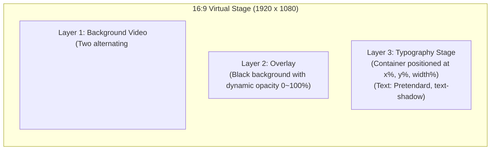
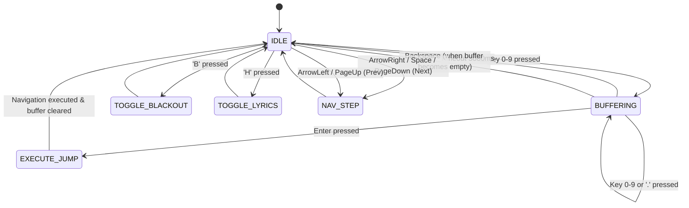
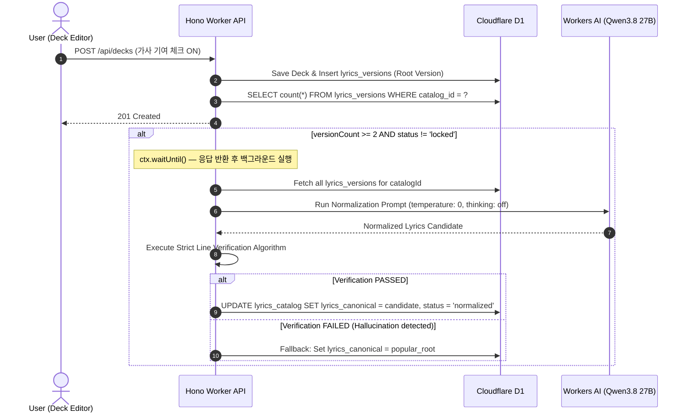

# 기술 디자인 명세서 (Technical Specification)

**문서 버전:** 1.2.0  
**최종 갱신:** 2026-09-21 (로컬 영속성 구현 반영)  
**작성자:** Senior Software Architect  
**대상 서비스:** 교회 찬양 슬라이드 제작 및 송출 서비스 (`prj-ppt`)  
**문서 상태:** Approved Design Spec — 일부 항목은 실제 구현과 맞추어 개정됨 (§2.2 구현 현황 참조)

> **1.1.0 개정 요약**
>
> 1. 배경 미디어 전송을 R2 커스텀 도메인 직통에서 **Worker 프록시(`/api/media/*`)** 로 정정했다 (§2.1, §5.4).
> 2. **클라이언트 영속성 3단계(인메모리 → IndexedDB → 서버 동기화)** 를 명시했다 (§5.5).
> 3. 사용자 커스텀 배경 업로드(PRD 4.3)를 데이터 모델과 API 계약에 반영했다 (§4.1, §7.1).
> 4. 각 구성 요소의 구현 여부를 §2.2 표로 명시했다. 설계만 있고 코드가 없는 항목을 구분한다.
>
> **1.2.0 개정 요약**
>
> 1. 클라이언트 영속성 **Phase 2(IndexedDB)를 구현**했다. §2.2·§5.5 상태를 갱신했다.
> 2. `decks` 스토어의 실제 역할(보관함 곡 전용)과 `by-presentation` 인덱스를 두지 않은 이유를 §5.4-4에 명시했다.
> 3. 구 localStorage 보관함(`worship_user_songs_v1`) 마이그레이션 규칙을 §5.5에 추가했다.

---

## 1. 개요 및 시스템 목적 (Overview & Architecture Principles)

### 1.1 시스템 목적

본 시스템은 중소형 교회 미디어 봉사자가 찬양 가사와 무음 모션 루프 영상을 결합하여 가독성 높은 16:9 예배용 슬라이드를 15분 이내에 제작하고, 예배 중 인터넷 장애가 발생하더라도 **끊김·검은 화면 없이 100% 오프라인에서 무사고로 송출**할 수 있도록 지원하는 웹 기반 경량 프레젠테이션 플랫폼이다.

### 1.2 핵심 아키텍처 원칙

1. **타입 단일 원천 (Single Source of Truth)**: 모든 도메인 모델, API 계약, 브로드캐스트 메시지, D1 JSON 컬럼 구조는 `packages/shared`의 **Zod 스키마**로 1회 선언하며, TypeScript 타입은 `z.infer`로만 추론한다. 수동 타입 복제는 금지한다.
2. **단방향 의존성 및 패키지 격리**:
   - `apps` $\rightarrow$ `packages` 단방향 참조만 허용.
   - `packages/db`는 Worker 전용 패키지로, 프론트엔드(`apps/web/src`)에서의 임포트는 ESLint로 차단한다.
   - 프론트엔드와 백엔드는 Hono RPC Client (`hc<AppType>`)를 통해서만 타입 안전하게 통신한다.
3. **로컬 우선 영속성과 무결점 오프라인 송출 (Local-First & Zero-Network Presentation)**:
   - 사용자의 작업은 서버가 아니라 **브라우저 로컬 저장소를 1차 원천**으로 삼는다. 로그인은 기기 간 동기화와 공유를 위한 것이지 편집의 전제 조건이 아니다 (§5.5).
   - 예배 중 송출 화면은 외부 네트워크 요청을 절대 발생시키지 않는다.
   - PWA Service Worker (`RangeRequestsPlugin`)와 `IndexedDB`를 통해 영상 및 세트 데이터를 완전히 로컬화한다.
4. **100ms 이내 결정론적 렌더링 (3-Layer DOM Architecture)**:
   - 캔버스나 무거운 프레임워크(Reveal.js) 대신, 브라우저 가속 DOM 3레이어(Video, Overlay, Text)를 사용하여 프레임 드랍 없이 슬라이드를 즉시 교체한다.
5. **프레젠테이션 간 독립성 보장 (Clone-on-Add)**:
   - 세트에 곡 추가 시 원본 덱을 세트 전용 덱으로 복제(Clone)하여 저장함으로써, 특정 주일의 수정 사항이 과거 프레젠테이션나 개인 라이브러리 원본을 오염시키지 않는다.

---

## 2. 시스템 아키텍처 및 경계 다이어그램 (System Architecture & Boundaries)

### 2.1 C4 컨테이너 다이어그램 (System Containers)

```mermaid
flowchart TB
  subgraph Client["Client Browser (Google Chrome Dedicated)"]
    subgraph FrontendSPA["React SPA (apps/web/src)"]
      UI["Editor / Presentation UI (shadcn/ui + Tailwind)"]
      StageRenderer["3-Layer Slide Stage"]
      DualWinController["Presenter Controller"]
      AudienceDisplay["Audience Projection View"]
      InputBuffer["Numeric Keypad Buffer Engine"]
    end

    subgraph BrowserStorage["Offline Storage Layer"]
      SW["Service Worker (Workbox + RangeRequests)"]
      CacheStorage["Cache Storage (App Shell, Fonts, R2 MP4)"]
      IDB[("IndexedDB (idb: Active Sets & Decks)")]
    end

    BC[("BroadcastChannel ('worship-projection')")]
    DualWinController <-->|IPC Sync| BC
    BC <-->|IPC Sync| AudienceDisplay
    StageRenderer <--> IDB
    SW <--> CacheStorage
  end

  subgraph CloudflarePlatform["Cloudflare Serverless Platform"]
    subgraph EdgeWorker["Cloudflare Worker (apps/web/worker)"]
      HonoAPI["Hono REST API (/api/*)"]
      AuthMiddleware["Better Auth Session Guard"]
    end

    subgraph StorageServices["Storage & Data"]
      D1DB[("Cloudflare D1 (SQLite + FTS5)")]
      R2Media[("Cloudflare R2 Bucket (Loop Videos + User Uploads)")]
    end

    subgraph AIEngine["AI Engine"]
      WorkersAI["Cloudflare Workers AI (@cf/qwen/qwen3.8-27b)"]
    end
  end

  UI -->|Hono RPC (/api/*)| HonoAPI
  HonoAPI --> AuthMiddleware
  AuthMiddleware --> D1DB
  HonoAPI --> WorkersAI

  MediaProxy["Media Proxy (/api/media/* · HTTP Range)"]
  HonoAPI --> MediaProxy
  MediaProxy --> R2Media
  BrowserStorage <-->|HTTP Range Partial Get (same-origin)| MediaProxy
```

배경 영상은 R2 커스텀 도메인 직통이 아니라 **같은 Worker의 `/api/media/*` 프록시**를 통해 전달한다. 동일 출처이므로 R2 CORS 설정이 필요 없고, Service Worker 캐시 규칙도 자체 오리진 경로 하나로 끝난다. 대신 영상 트래픽이 Worker 요청 수·CPU 시간에 계상되므로, 사용량이 커지면 커스텀 도메인 직통으로 되돌리는 선택지를 남겨 둔다. 그때 바뀌는 것은 URL 생성 헬퍼(`getBackgroundMediaUrl`)와 Workbox `urlPattern` 두 곳뿐이다.

### 2.2 구현 현황 스냅샷 (2026-09-21)

본 명세의 항목 중 실제 코드가 있는 것과 설계만 있는 것을 구분한다. 이 표를 갱신하지 않은 채 "스펙에 있으니 구현되어 있다"고 가정하지 않는다.

| 구성 요소                                     | 상태     | 비고                                                                                       |
| --------------------------------------------- | -------- | ------------------------------------------------------------------------------------------ |
| `packages/shared` Zod 스키마 (§3)             | 구현     | Deck·Slide·Style·Presentation·Broadcast·API 전부 존재                                      |
| `packages/db` Drizzle 스키마·마이그레이션(§4) | 구현     | 0000_initial, 0001_fts5 적용됨                                                             |
| 스코프 쿼리 헬퍼 (§4.3)                       | 부분     | decks·presentations·backgrounds 헬퍼 존재. 실제 호출부는 `/api/backgrounds` 하나뿐         |
| 3-Layer Slide Stage (§5.1)                    | 구현     | `components/stage/*` — 편집기와 송출이 동일 컴포넌트 사용                                  |
| 입력 버퍼 엔진·단축키 (§5.2)                  | 구현     | `useNavigationBuffer`, `usePresentationShortcuts` (tinykeys)                               |
| 세트 편집기 (PRD 4.4)                         | 부분     | 속성 패널·드래그·리사이즈·스트립 구현. 넘침 경고와 커서 기준 분할·합치기 미구현            |
| 미디어 프록시 `/api/media/*` (§5.4)           | 구현     | HTTP Range 지원                                                                            |
| **클라이언트 영속성 (§5.5)**                  | **구현** | IndexedDB Phase 2 완료. `presentationStore`·`songLibraryStore`가 문서 단위로 저장·복원한다 |
| Hono RPC 클라이언트 (`hc<AppType>`)           | 미구현   | `apps/web/src`에 `fetch` 호출이 0건. 배경 목록도 `INITIAL_BACKGROUNDS` 상수를 직접 읽는다  |
| Better Auth (§4.1 auth 테이블)                | 스키마만 | 테이블·컬럼만 있고 런타임 연동 없음                                                        |
| 발표자 보기·BroadcastChannel (§5.3)           | 스키마만 | `BroadcastMessageSchema`만 존재. 사용처 없음                                               |
| PWA·Cache Storage (§5.4)                      | 미구현   | vite-plugin-pwa 미설치. IndexedDB(`idb`)는 도입 완료                                       |
| Workers AI 가사 정규화 (§6)                   | 미구현   | `verifyNormalization` 검증 함수만 구현됨                                                   |
| 공유·가사 라이브러리 API (§7)                 | 미구현   | 화면은 샘플 데이터로 선행 구현                                                             |
| 사용자 커스텀 배경 업로드 (PRD 4.3)           | 미구현   | 배경 라이브러리 화면에 안내만 있음                                                         |
| 저장 실패 경고 배너                           | 구현     | `StorageWarningBanner` — 용량 초과와 저장소 차단을 구분, 닫을 수 없음                      |

---

## 3. packages/shared: 도메인 모델 및 Zod 스키마 명세

`packages/shared`는 브라우저와 Cloudflare Worker 양쪽에서 실행되는 순수 TypeScript 패키지이다.

### 3.1 슬라이드 및 스타일 기본 스키마 (`schemas/style.ts`, `schemas/slide.ts`)

```typescript
import { z } from "zod";

/**
 * 3x3 격자 앵커 프리셋
 */
export const GridAnchorPresetSchema = z.enum([
  "top-left",
  "top-center",
  "top-right",
  "middle-left",
  "middle-center",
  "middle-right",
  "bottom-left",
  "bottom-center",
  "bottom-right",
  "custom",
]);
export type GridAnchorPreset = z.infer<typeof GridAnchorPresetSchema>;

/**
 * 슬라이드 텍스트 박스 위치 및 크기 (%)
 * 16:9 가상 스테이지(1920x1080) 기준 퍼센트 (0 ~ 100)
 */
export const TextBoxPositionSchema = z.object({
  anchor: GridAnchorPresetSchema.default("middle-center"),
  xPercent: z.number().min(5).max(95).default(50), // 앵커 X 좌표
  yPercent: z.number().min(5).max(95).default(50), // 앵커 Y 좌표
  widthPercent: z.number().min(20).max(90).default(80), // 텍스트 박스 최대 가로폭
});
export type TextBoxPosition = z.infer<typeof TextBoxPositionSchema>;

/**
 * 곡(Deck) 단위 타이포그래피 및 가독성 스타일
 */
export const DeckStyleSchema = z.object({
  // 오버레이 설정
  overlayOpacity: z.number().min(0).max(100).default(40), // 0 ~ 100%
  overlayColor: z
    .string()
    .regex(/^#([0-9a-fA-F]{3}){1,2}$/)
    .default("#000000"),

  // 폰트 및 텍스트 설정
  fontFamily: z
    .enum([
      "Pretendard",
      "Noto Sans KR",
      "Nanum Myeongjo",
      "Gmarket Sans",
      "KoPubWorld Batang",
    ])
    .default("Pretendard"),
  fontSizeVw: z.number().min(2).max(10).default(4.2), // 16:9 기준 상대 폰트 크기
  fontColor: z
    .string()
    .regex(/^#([0-9a-fA-F]{3}){1,2}$/)
    .default("#FFFFFF"),
  textAlign: z.enum(["left", "center", "right"]).default("center"),
  lineHeight: z.number().min(1.0).max(2.5).default(1.4),

  // 그림자 (가독성 핵심)
  textShadowLevel: z
    .enum(["none", "soft", "medium", "strong"])
    .default("medium"),

  // 텍스트 박스 위치
  position: TextBoxPositionSchema.default({
    anchor: "middle-center",
    xPercent: 50,
    yPercent: 50,
    widthPercent: 80,
  }),
});
export type DeckStyle = z.infer<typeof DeckStyleSchema>;

/**
 * 슬라이드 1장 데이터 (경량화 ID 및 최대 4줄 제약)
 */
export const SlideSchema = z.object({
  id: z
    .string()
    .min(1)
    .default(() => `s_${Math.random().toString(36).substring(2, 9)}`),
  order: z.number().int().nonnegative(),
  lines: z.array(z.string().max(80)).max(4), // 슬라이드당 최대 4줄 제약 (PRD 4.2)
});
export type Slide = z.infer<typeof SlideSchema>;
```

### 3.2 덱(Deck) 및 프레젠테이션(Presentation) 스키마 (`schemas/deck.ts`, `schemas/presentation.ts`)

```typescript
import { z } from "zod";
import { SlideSchema } from "./slide";
import { DeckStyleSchema } from "./style";

export const DeckVisibilitySchema = z.enum(["private", "public"]);
export type DeckVisibility = z.infer<typeof DeckVisibilitySchema>;

/**
 * 덱 스코프: 라이브러리 마스터 덱 vs 프레젠테이션 복제 전용 덱
 */
export const DeckScopeSchema = z.enum(["library", "presentation"]);
export type DeckScope = z.infer<typeof DeckScopeSchema>;

export const DeckSchema = z.object({
  id: z.string().uuid(),
  userId: z.string().uuid(),
  catalogId: z.string().uuid().nullable().optional(),
  scope: DeckScopeSchema.default("library"), // 'library': 보관함 마스터, 'presentation': 프레젠테이션 전용 복제본
  presentationId: z.string().uuid().nullable().optional(), // scope='presentation'일 때 속한 프레젠테이션 ID
  title: z.string().min(1).max(100),
  artist: z.string().max(100).default(""),
  lyricsRaw: z.string(),
  slides: z.array(SlideSchema),
  backgroundId: z.string().uuid().nullable(),
  style: DeckStyleSchema,
  visibility: DeckVisibilitySchema.default("private"),
  forkedFrom: z.string().uuid().nullable().optional(), // 원본 덱 ID (Clone/Fork 출처 추적)
  forkCount: z.number().int().nonnegative().default(0),
  createdAt: z.string().datetime(),
  updatedAt: z.string().datetime(),
});
export type Deck = z.infer<typeof DeckSchema>;

export const PresentationItemSchema = z.object({
  id: z.string().uuid(),
  presentationId: z.string().uuid(),
  deckId: z.string().uuid(),
  order: z.number().int().nonnegative(),
  deck: DeckSchema.optional(), // Hydrated relation
});
export type PresentationItem = z.infer<typeof PresentationItemSchema>;

export const PresentationSchema = z.object({
  id: z.string().uuid(),
  userId: z.string().uuid(),
  title: z.string().min(1).max(100),
  serviceDate: z.string().regex(/^\d{4}-\d{2}-\d{2}$/), // YYYY-MM-DD
  items: z.array(PresentationItemSchema).default([]),
  createdAt: z.string().datetime(),
  updatedAt: z.string().datetime(),
});
export type Presentation = z.infer<typeof PresentationSchema>;
```

### 3.3 배경 미디어 및 가사 카탈로그 스키마 (`schemas/media.ts`, `schemas/catalog.ts`)

```typescript
export const BackgroundMediaSchema = z.object({
  id: z.string().uuid(),
  title: z.string().min(1).max(100),
  r2Key: z.string(), // R2 내 파일 경로 (mp4)
  posterKey: z.string(), // 썸네일 경로 (webp)
  durationSec: z.number().positive(),
  license: z.string(),
  tags: z.array(z.string()), // ["잔잔한", "따뜻한"]
  cdnUrl: z.string().url(), // https://media.domain.com/loop_01.mp4
  posterUrl: z.string().url(),
});
export type BackgroundMedia = z.infer<typeof BackgroundMediaSchema>;

export const CatalogStatusSchema = z.enum(["single", "normalized", "locked"]);
export type CatalogStatus = z.infer<typeof CatalogStatusSchema>;

export const LyricCatalogSchema = z.object({
  id: z.string().uuid(),
  title: z.string().min(1).max(100),
  artist: z.string().max(100).default(""),
  titleNorm: z.string(),
  artistNorm: z.string(),
  lyricsCanonical: z.string(),
  versionCount: z.number().int().nonnegative().default(1),
  status: CatalogStatusSchema.default("single"),
  normalizedAt: z.string().datetime().nullable(),
});
export type LyricCatalog = z.infer<typeof LyricCatalogSchema>;
```

### 3.4 BroadcastChannel 동기화 프로토콜 (`schemas/broadcast.ts`)

발표자 조작 창(Controller)과 송출 창(Audience Window)은 `new BroadcastChannel('worship-projection')`을 통해 동기화된다.

```typescript
export const BroadcastMessageSchema = z.discriminatedUnion("type", [
  // 1. 송출 창 준비 완료 신호
  z.object({
    type: z.literal("AUDIENCE_MOUNTED"),
    timestamp: z.number(),
  }),
  // 2. 조작 창에서 송출 창으로 전체 상태 주입 (스냅샷)
  z.object({
    type: z.literal("SYNC_SNAPSHOT"),
    timestamp: z.number(),
    payload: z.object({
      presentationId: z.string().uuid(),
      currentSongIndex: z.number().int().nonnegative(),
      currentSlideIndex: z.number().int().nonnegative(),
      isBlackout: z.boolean(),
      isLyricsHidden: z.boolean(),
    }),
  }),
  // 3. 슬라이드 직접 이동
  z.object({
    type: z.literal("NAVIGATE_SLIDE"),
    timestamp: z.number(),
    payload: z.object({
      songIndex: z.number().int().nonnegative(),
      slideIndex: z.number().int().nonnegative(),
    }),
  }),
  // 4. 긴급 블랙아웃 토글
  z.object({
    type: z.literal("SET_BLACKOUT"),
    timestamp: z.number(),
    payload: z.object({
      isBlackout: z.boolean(),
    }),
  }),
  // 5. 가사 숨기기 (배경 유지)
  z.object({
    type: z.literal("SET_LYRICS_HIDDEN"),
    timestamp: z.number(),
    payload: z.object({
      isLyricsHidden: z.boolean(),
    }),
  }),
  // 6. 하트비트 / 핑퐁
  z.object({
    type: z.literal("HEARTBEAT"),
    timestamp: z.number(),
  }),
]);
export type BroadcastMessage = z.infer<typeof BroadcastMessageSchema>;
```

---

## 4. 데이터베이스 아키텍처 및 Drizzle/D1 스키마 (`packages/db`)

Cloudflare D1(SQLite)을 영속성 엔진으로 사용하며, Drizzle ORM을 통해 마이그레이션과 질의를 관리한다.

### 4.0 스키마 비판적 검증 및 정규화 분석 (Critical Schema Audit & Normalization)

소프트웨어 아키텍트 관점에서 D1 SQLite의 제약사항(분산 SQLite, 파일 크기 한계, RLS 부재)과 PRD의 비기능 제약(100ms 반응성, 무결점 오프라인)을 만족시키기 위해 다음 6가지 핵심 항목에 대한 비판적 검증과 스키마 최적화를 단행한다.

#### 1. Clone-on-Add 방식의 정규화 최적화 (고아 데이터 방지 및 라이브러리 격리)

- **문제점**: 프레젠테이션(Presentation)에 곡을 추가할 때 덱을 복제하면, `decks` 테이블에 수백 개의 복제 행이 누적된다.
  1. `userId`로 덱을 단순 조회하면 과거 프레젠테이션의 복제본들이 '내 라이브러리'에 중복 노출되어 UI가 오염된다.
  2. 프레젠테이션(`presentations`) 삭제 시 `presentation_items`는 지워지지만 복제된 `decks` 행은 참조가 끊긴 채 **영구 고아 데이터(Orphaned Row)**로 남아 D1 저장 공간을 낭비한다.
- **최적화 설계**:
  - `decks` 테이블에 `scope: 'library' | 'presentation'`와 `presentation_id` 외래키를 추가한다.
  - 라이브러리 덱은 `scope = 'library', presentation_id = null`로 유지되고, 세트 복제본은 `scope = 'presentation', presentation_id = presentation.id`로 명확히 격리된다.
  - `presentation_id`에 `ON DELETE CASCADE`를 설정하여 프레젠테이션 삭제 시 종속된 복제 덱들이 데이터베이스 엔진 레벨에서 원자적으로 함께 삭제되도록 무결성을 보장한다.
  - 인덱스 `(user_id, scope)`를 구성하여 라이브러리 조회(`scope = 'library'`)의 인덱스 풀 스캔을 보장한다.

#### 2. JSON TEXT 컬럼 반정규화(Pragmatic Denormalization)의 타당성

- **검증**: `decks.slides`와 `decks.style`을 관계형 정규화(1NF)하여 별도의 `slides` 테이블로 분리할 것인가?
- **결론**: **JSON TEXT 유지 (실용적 반정규화 채택)**.
  - 예배 송출 시 슬라이드는 개별 행으로 검색되지 않으며, 항상 곡 단위의 원자적(Atomic) 문서로 소비된다.
  - 1개 프레젠테이션(5곡 × 평균 15슬라이드 = 75행)를 로드할 때 RDB 조인(JOIN) 연산을 발생시키는 대신, 단일 SELECT 쿼리로 100ms 이내에 즉각 응답하는 것이 PRD의 성능 목표(6.2)에 부합한다.
  - 내부 무결성은 애플리케이션 계층에서 `SlideSchema.array()` 및 `DeckStyleSchema`로 100% 검증한다. 슬라이드 ID 또한 무거운 UUID 대신 경량 ID(`s_xxx`)를 채택하여 JSON 페이로드 크기를 절감한다.

#### 3. Better Auth v1 공식 스키마 정규화 완결성

- **검증**: Better Auth의 Drizzle D1 어댑터가 요구하는 필수 필드(`emailVerified`, `session.ipAddress`, `session.userAgent`, `account.scope`, `account.idToken`, `verification` 테이블)가 누락되면 인스턴스 초기화 시 런타임 스키마 에러가 발생한다.
- **최적화 설계**: Better Auth v1 공식 규격의 컬럼과 테이블을 완벽히 매핑하여 인증 호환성을 보장한다.

#### 4. `lyrics_versions` 1인 1표 정규화와 멱등적 업서트(Upsert)

- **검증**: 동일 사용자가 가사를 교정하여 같은 곡을 다시 저장할 경우, `uniqueIndex(user_id, catalog_id)`에 의해 `SQLITE_CONSTRAINT_UNIQUE` 예외가 발생한다.
- **최적화 설계**: 1인 1표 원칙(PRD 4.8)을 준수하되, `INSERT ... ON CONFLICT (user_id, catalog_id) DO UPDATE SET lyrics = excluded.lyrics, deck_id = excluded.deck_id, updated_at = unixepoch()` 업서트 쿼리를 강제한다.
- `lyrics_catalog.version_count`는 SQLite 트리거를 통해 원자적으로 증감시켜 카운트 불일치를 원천 방지한다.

#### 5. 사용자 커스텀 배경의 노출 격리 (PRD 4.3)

- **문제점**: 커스텀 배경을 `backgrounds`에 함께 넣으면, 배경 목록 API가 남의 업로드까지 뿌리거나 공개 덱이 남의 배경을 참조하게 된다.
- **설계**: `source`/`owner_user_id`로 구분하고 쿼리 헬퍼에서 강제한다.
  - 배경 목록 조회는 `source = 'service' OR owner_user_id = :userId` 조건을 헬퍼 안에 고정한다. 라우트에서 임의 조건을 조립하지 않는다.
  - 공개 덱 조회·포크 시 `backgroundId`가 `source = 'user'` 배경을 가리키면 서비스 기본 배경 id로 치환해 내보낸다. 남의 업로드가 공개 경로로 새는 것을 원천 차단한다.
  - 계정 삭제 시 `owner_user_id` CASCADE로 메타데이터가 지워지고, R2 객체는 같은 트랜잭션 뒤 정리 작업에서 제거한다.
- **용량 한도**: 업로드 전 `SELECT SUM(size_bytes) WHERE owner_user_id = ?`로 300MB 한도를 검사한다 (PRD 6.3).

---

### 4.1 테이블 명세 및 최적화된 Drizzle 스키마 정의 (`schema/*.ts`)

```typescript
import {
  sqliteTable,
  text,
  integer,
  index,
  uniqueIndex,
} from "drizzle-orm/sqlite-core";
import { sql } from "drizzle-orm";

// ============================================================================
// 1. Better Auth v1 공식 완결 스키마 (OAuth 카카오/네이버)
// ============================================================================
export const user = sqliteTable("user", {
  id: text("id").primaryKey(),
  name: text("name").notNull(),
  email: text("email"), // 카카오 기본 권한 시 null 허용
  emailVerified: integer("email_verified", { mode: "boolean" })
    .notNull()
    .default(false),
  image: text("image"),
  createdAt: integer("created_at", { mode: "timestamp" }).notNull(),
  updatedAt: integer("updated_at", { mode: "timestamp" }).notNull(),
});

export const session = sqliteTable("session", {
  id: text("id").primaryKey(),
  userId: text("user_id")
    .notNull()
    .references(() => user.id, { onDelete: "cascade" }),
  token: text("token").notNull().unique(),
  expiresAt: integer("expires_at", { mode: "timestamp" }).notNull(),
  ipAddress: text("ip_address"),
  userAgent: text("user_agent"),
  createdAt: integer("created_at", { mode: "timestamp" }).notNull(),
  updatedAt: integer("updated_at", { mode: "timestamp" }).notNull(),
});

export const account = sqliteTable("account", {
  id: text("id").primaryKey(),
  userId: text("user_id")
    .notNull()
    .references(() => user.id, { onDelete: "cascade" }),
  accountId: text("account_id").notNull(),
  providerId: text("provider_id").notNull(), // 'kakao' | 'naver'
  accessToken: text("access_token"),
  refreshToken: text("refresh_token"),
  accessTokenExpiresAt: integer("access_token_expires_at", {
    mode: "timestamp",
  }),
  refreshTokenExpiresAt: integer("refresh_token_expires_at", {
    mode: "timestamp",
  }),
  scope: text("scope"),
  idToken: text("id_token"),
  password: text("password"),
  createdAt: integer("created_at", { mode: "timestamp" }).notNull(),
  updatedAt: integer("updated_at", { mode: "timestamp" }).notNull(),
});

export const verification = sqliteTable("verification", {
  id: text("id").primaryKey(),
  identifier: text("identifier").notNull(),
  value: text("value").notNull(),
  expiresAt: integer("expires_at", { mode: "timestamp" }).notNull(),
  createdAt: integer("created_at", { mode: "timestamp" }).notNull(),
  updatedAt: integer("updated_at", { mode: "timestamp" }).notNull(),
});

// ============================================================================
// 2. 가사 카탈로그 및 버전 테이블 (LLM 정규화 파이프라인)
// ============================================================================
export const lyricsCatalog = sqliteTable(
  "lyrics_catalog",
  {
    id: text("id").primaryKey(),
    title: text("title").notNull(),
    artist: text("artist").default(""),
    titleNorm: text("title_norm").notNull(), // 공백·특수문자 제거, 소문자
    artistNorm: text("artist_norm").notNull(),
    lyricsCanonical: text("lyrics_canonical").notNull(),
    versionCount: integer("version_count").notNull().default(1),
    status: text("status", { enum: ["single", "normalized", "locked"] })
      .notNull()
      .default("single"),
    normalizedAt: integer("normalized_at", { mode: "timestamp" }),
    createdAt: integer("created_at", { mode: "timestamp" }).default(
      sql`(unixepoch())`,
    ),
    updatedAt: integer("updated_at", { mode: "timestamp" }).default(
      sql`(unixepoch())`,
    ),
  },
  (t) => [
    index("idx_lyrics_catalog_norm").on(t.titleNorm, t.artistNorm),
    index("idx_lyrics_catalog_status").on(t.status),
  ],
);

export const lyricsVersions = sqliteTable(
  "lyrics_versions",
  {
    id: text("id").primaryKey(),
    catalogId: text("catalog_id")
      .notNull()
      .references(() => lyricsCatalog.id, { onDelete: "cascade" }),
    userId: text("user_id")
      .notNull()
      .references(() => user.id),
    deckId: text("deck_id").notNull(), // 루트 덱 ID
    lyrics: text("lyrics").notNull(),
    source: text("source").default("user"),
    createdAt: integer("created_at", { mode: "timestamp" }).default(
      sql`(unixepoch())`,
    ),
    updatedAt: integer("updated_at", { mode: "timestamp" }).default(
      sql`(unixepoch())`,
    ),
  },
  (t) => [
    index("idx_lyrics_versions_catalog").on(t.catalogId),
    // 1인 1표 보장을 위한 복합 고유 인덱스
    uniqueIndex("idx_lyrics_versions_user_catalog").on(t.userId, t.catalogId),
  ],
);

// ============================================================================
// 3. 배경 영상 메타데이터
// ============================================================================
export const backgrounds = sqliteTable(
  "backgrounds",
  {
    id: text("id").primaryKey(),
    title: text("title").notNull(),
    r2Key: text("r2_key").notNull(),
    posterKey: text("poster_key").notNull(),
    durationSec: integer("duration_sec").notNull(),
    license: text("license").notNull(),
    tags: text("tags").notNull(), // JSON TEXT: string[]

    // 사용자 커스텀 배경 (PRD 4.3) — 사전 주입 배경과 한 테이블에서 관리
    source: text("source", { enum: ["service", "user"] })
      .notNull()
      .default("service"),
    ownerUserId: text("owner_user_id").references(() => user.id, {
      onDelete: "cascade",
    }), // source='user'일 때만 채워진다
    kind: text("kind", { enum: ["video", "image"] })
      .notNull()
      .default("video"),
    sizeBytes: integer("size_bytes").notNull().default(0), // 계정당 300MB 한도 집계용

    createdAt: integer("created_at", { mode: "timestamp" }).default(
      sql`(unixepoch())`,
    ),
  },
  (t) => [
    // 사전 주입 목록 조회(source='service')와 내 업로드 조회를 각각 인덱스로 받는다
    index("idx_backgrounds_source").on(t.source),
    index("idx_backgrounds_owner").on(t.ownerUserId),
  ],
);

// ============================================================================
// 4. 덱 (Deck) - 찬양 1곡 단위 (라이브러리 마스터 vs 프레젠테이션 복제 격리)
// ============================================================================
export const decks = sqliteTable(
  "decks",
  {
    id: text("id").primaryKey(),
    userId: text("user_id")
      .notNull()
      .references(() => user.id, { onDelete: "cascade" }),
    catalogId: text("catalog_id").references(() => lyricsCatalog.id, {
      onDelete: "set null",
    }),

    // 스코프 격리 및 프레젠테이션 종속성
    scope: text("scope", { enum: ["library", "presentation"] })
      .notNull()
      .default("library"),
    presentationId: text("presentation_id").references(() => presentations.id, {
      onDelete: "cascade",
    }),

    title: text("title").notNull(),
    artist: text("artist").default(""),
    lyricsRaw: text("lyrics_raw").notNull(),
    slides: text("slides").notNull(), // JSON TEXT: Slide[]
    backgroundId: text("background_id").references(() => backgrounds.id, {
      onDelete: "set null",
    }),
    style: text("style").notNull(), // JSON TEXT: DeckStyle

    visibility: text("visibility", { enum: ["private", "public"] })
      .notNull()
      .default("private"),
    forkedFrom: text("forked_from"), // 원본 덱 ID (Clone-on-Add 또는 Fork 출처)
    forkCount: integer("fork_count").notNull().default(0),

    createdAt: integer("created_at", { mode: "timestamp" }).default(
      sql`(unixepoch())`,
    ),
    updatedAt: integer("updated_at", { mode: "timestamp" }).default(
      sql`(unixepoch())`,
    ),
  },
  (t) => [
    index("idx_decks_user_scope").on(t.userId, t.scope), // 내 보관함 필터링 최적화
    index("idx_decks_presentation").on(t.presentationId), // 세트 종속 덱 조회
    index("idx_decks_visibility_forks").on(t.visibility, t.forkCount),
    index("idx_decks_catalog").on(t.catalogId),
  ],
);

// ============================================================================
// 5. 예배 프레젠테이션 (Presentation) 및 항목
// ============================================================================
export const presentations = sqliteTable(
  "presentations",
  {
    id: text("id").primaryKey(),
    userId: text("user_id")
      .notNull()
      .references(() => user.id, { onDelete: "cascade" }),
    title: text("title").notNull(),
    serviceDate: text("service_date").notNull(), // 'YYYY-MM-DD'
    createdAt: integer("created_at", { mode: "timestamp" }).default(
      sql`(unixepoch())`,
    ),
    updatedAt: integer("updated_at", { mode: "timestamp" }).default(
      sql`(unixepoch())`,
    ),
  },
  (t) => [index("idx_presentations_user_date").on(t.userId, t.serviceDate)],
);

export const presentationItems = sqliteTable(
  "presentation_items",
  {
    id: text("id").primaryKey(),
    presentationId: text("presentation_id")
      .notNull()
      .references(() => presentations.id, { onDelete: "cascade" }),
    deckId: text("deck_id")
      .notNull()
      .references(() => decks.id, { onDelete: "cascade" }),
    order: integer("order").notNull(),
  },
  (t) => [
    index("idx_presentation_items_order").on(t.presentationId, t.order),
    uniqueIndex("idx_presentation_items_unique").on(t.presentationId, t.deckId),
  ],
);

// ============================================================================
// 6. 오류 신고 및 저작권 요청
// ============================================================================
export const reports = sqliteTable("reports", {
  id: text("id").primaryKey(),
  userId: text("user_id").references(() => user.id),
  targetType: text("target_type", { enum: ["deck", "catalog"] }).notNull(),
  targetId: text("target_id").notNull(),
  reason: text("reason").notNull(),
  status: text("status", { enum: ["pending", "resolved", "rejected"] }).default(
    "pending",
  ),
  createdAt: integer("created_at", { mode: "timestamp" }).default(
    sql`(unixepoch())`,
  ),
});
```

### 4.2 FTS5 Trigram 검색 가상 테이블 마이그레이션 (`drizzle/0001_fts5.sql`)

공개 덱 및 가사 라이브러리 고속 검색을 위해 SQLite FTS5 Trigram 인덱스를 생성한다.

```sql
-- FTS5 Trigram 검색 인덱스 (Deck용)
CREATE VIRTUAL TABLE IF NOT EXISTS decks_fts USING fts5(
  deck_id UNINDEXED,
  title,
  artist,
  tokenize='trigram'
);

-- Trigram 동기화 트리거
CREATE TRIGGER IF NOT EXISTS trg_decks_insert AFTER INSERT ON decks
WHEN new.visibility = 'public'
BEGIN
  INSERT INTO decks_fts (deck_id, title, artist) VALUES (new.id, new.title, new.artist);
END;

CREATE TRIGGER IF NOT EXISTS trg_decks_update AFTER UPDATE ON decks
BEGIN
  DELETE FROM decks_fts WHERE deck_id = old.id;
  INSERT INTO decks_fts (deck_id, title, artist)
  SELECT new.id, new.title, new.artist WHERE new.visibility = 'public';
END;

CREATE TRIGGER IF NOT EXISTS trg_decks_delete AFTER DELETE ON decks
BEGIN
  DELETE FROM decks_fts WHERE deck_id = old.id;
END;
```

### 4.3 D1 보안 가드레일: 중앙 집중식 스코프 쿼리 헬퍼 (`queries/*.ts`)

D1에는 Postgres RLS가 없으므로 애플리케이션 계층에서 `userId` 및 `visibility`를 엄격히 강제한다.

```typescript
// packages/db/src/queries/decks.ts
import { eq, and, desc, sql } from "drizzle-orm";
import { db } from "../client";
import { decks, decksFts, lyricsVersions, lyricsCatalog } from "../schema";

/**
 * FTS5 쿼리 새니타이저
 * 특수문자 및 FTS5 제어 연산자(AND, OR, NOT, NEAR, *, (), ") 주입 공격 방지
 */
export function sanitizeFts5Query(query: string): string {
  // 영문/한글/숫자/공백만 남기고 모든 특수기호 제거
  const cleaned = query.replace(/[^\p{L}\p{N}\s]/gu, " ").trim();
  const tokens = cleaned.split(/\s+/).filter(Boolean);
  if (tokens.length === 0) return "";
  // 각 토큰을 큰따옴표로 감싸 안전한 MATCH 구문 생성: "은혜로운" "찬양"
  return tokens.map((t) => `"${t}"`).join(" ");
}

export const deckQueries = {
  // 1. 사용자 본인 소유 '내 라이브러리' 마스터 덱 목록 조회 (프레젠테이션 복제본 제외)
  async getMyLibraryDecks(userId: string) {
    return db
      .select()
      .from(decks)
      .where(
        and(
          eq(decks.userId, userId),
          eq(decks.scope, "library"), // 프레젠테이션용 복제 덱 필터링 (UI 오염 방지)
        ),
      )
      .orderBy(desc(decks.updatedAt));
  },

  // 2. 사용자 본인 소유 덱 단건 조회
  async getByIdScoped(deckId: string, userId: string) {
    const [result] = await db
      .select()
      .from(decks)
      .where(and(eq(decks.id, deckId), eq(decks.userId, userId)));
    return result ?? null;
  },

  // 3. 공개 덱 안전 조회 (비공개 덱 유출 원천 차단)
  async getPublicById(deckId: string) {
    const [result] = await db
      .select()
      .from(decks)
      .where(and(eq(decks.id, deckId), eq(decks.visibility, "public")));
    return result ?? null;
  },

  // 4. FTS5 Trigram + LIKE 하이브리드 고속 검색 (새니타이징 적용)
  async searchPublicDecks(query: string, limit = 20) {
    const trimmed = query.trim();
    if (!trimmed) return [];

    if (trimmed.length >= 3) {
      const sanitizedFts = sanitizeFts5Query(trimmed);
      if (!sanitizedFts) return [];

      // 3자 이상: FTS5 Trigram MATCH 쿼리
      return db
        .select({ deck: decks })
        .from(decks)
        .innerJoin(decksFts, eq(decks.id, decksFts.deckId))
        .where(
          and(
            eq(decks.visibility, "public"),
            sql`decks_fts MATCH ${sanitizedFts}`,
          ),
        )
        .orderBy(desc(decks.forkCount))
        .limit(limit);
    } else {
      // 2자 이하: LIKE 쿼리 안전 폴백
      return db
        .select()
        .from(decks)
        .where(
          and(
            eq(decks.visibility, "public"),
            sql`(${decks.title} LIKE ${`%${trimmed}%`} OR ${decks.artist} LIKE ${`%${trimmed}%`})`,
          ),
        )
        .orderBy(desc(decks.forkCount))
        .limit(limit);
    }
  },

  // 5. 가사 버전 1인 1표 멱등적 업서트 (Upsert)
  async upsertLyricVersion(params: {
    catalogId: string;
    userId: string;
    deckId: string;
    lyrics: string;
  }) {
    return db
      .insert(lyricsVersions)
      .values({
        id: crypto.randomUUID(),
        catalogId: params.catalogId,
        userId: params.userId,
        deckId: params.deckId,
        lyrics: params.lyrics,
        source: "user",
      })
      .onConflictDoUpdate({
        target: [lyricsVersions.userId, lyricsVersions.catalogId],
        set: {
          lyrics: params.lyrics,
          deckId: params.deckId,
          updatedAt: sql`(unixepoch())`,
        },
      });
  },
};
```

---

## 5. 비기능 요구사항 충족을 위한 렌더링 & 상태 관리 아키텍처

### 5.1 3-Layer Slide Stage 렌더링 엔진

프레젠테이션 및 편집기 미리보기는 **16:9 고정 가상 캔버스 (1920x1080)** 로 렌더링되며, 컨테이너 크기에 맞춰 CSS `transform: scale(s)`로 왜곡 없이 스케일링된다.



#### 레이어별 구현 규칙:

1. **Layer 1: Background Video (무결점 전환)**:
   - 두 개의 `<video>` 태그(`Video-A`, `Video-B`)를 겹쳐 배치한다.
   - 곡이 유지되는 동안에는 동일 비디오 태그가 일시정지 없이 루프 재생된다.
   - 곡이 넘어갈 때 다음 비디오를 백그라운드 태그에 미리 로드(`preload="auto"`)하고, `canplay` 이벤트 발생 시 `opacity` 트랜지션(0.2s)으로 크로스페이드 교체하여 **검은 화면(Black Flicker) 발생 가능성을 0%로 만든다**.
2. **Layer 2: Overlay Layer**:
   - `background-color: #000000; opacity: ${style.overlayOpacity / 100};`
   - 순수 CSS 오버레이로 GPU 합성 레이어에서 초당 60fps를 유지한다.
3. **Layer 3: Typography & Text Box**:
   - 위치 계산: `left: ${pos.xPercent}%; top: ${pos.yPercent}%; width: ${pos.widthPercent}%;`
   - 앵커 성장 규칙:
     - `bottom-*` 앵커: `transform: translate(..., -100%)` $\rightarrow$ 줄 수가 늘어나면 위로 자람.
     - `middle-*` 앵커: `transform: translate(..., -50%)` $\rightarrow$ 줄 수가 늘어나면 상하 대칭으로 자람.
     - `top-*` 앵커: `transform: translate(..., 0)` $\rightarrow$ 줄 수가 늘어나면 아래로 자람.
   - 텍스트 그림자: 가독성 보장을 위해 4단계 프리셋 CSS 적용.
     - `medium`: `0 2px 8px rgba(0, 0, 0, 0.8), 0 0 2px rgba(0, 0, 0, 0.9)`

### 5.2 100ms 반응성 및 송출 상태 머신 (Input Buffer Engine)

키보드 및 USB 숫자 키패드 입력을 처리하기 위한 상태 전이 엔진 명세:



#### 번호 파싱 알고리즘:

- `N` + Enter $\rightarrow$ 현재 곡의 N번째 슬라이드로 점프 (`slideIndex = N - 1`).
- `N.` + Enter $\rightarrow$ N번째 곡의 1번째 슬라이드로 점프 (`songIndex = N - 1, slideIndex = 0`).
- `N.M` + Enter $\rightarrow$ N번째 곡의 M번째 슬라이드로 점프 (`songIndex = N - 1, slideIndex = M - 1`).
- 유효하지 않은 인덱스인 경우: 명령을 무시하고 조작 창에만 2초간 경고 토스트 노출, 청중 송출 창에는 아무것도 띄우지 않음.

### 5.3 발표자 보기 및 Chrome Window Management 연동

Chrome 공식 **Window Management API**를 활용한 다중 디스플레이 투영 아키텍처:

1. **디스플레이 감지 및 팝업 배치**:
   ```typescript
   async function openAudienceProjection(presentationId: string) {
     if ("getScreenDetails" in window) {
       try {
         const screenDetails = await (window as any).getScreenDetails();
         const secondaryScreen = screenDetails.screens.find(
           (s: any) => s !== screenDetails.currentScreen,
         );
         if (secondaryScreen) {
           // 보조 모니터 위치로 송출 창 바로 팝업 오픈
           window.open(
             `/present/audience?setId=${presentationId}`,
             "WorshipAudienceWindow",
             `left=${secondaryScreen.availLeft},top=${secondaryScreen.availTop},width=${secondaryScreen.availWidth},height=${secondaryScreen.availHeight}`,
           );
           return;
         }
       } catch (err) {
         // 권한 거부 시 일반 팝업 폴백
       }
     }
     window.open(
       `/present/audience?setId=${presentationId}`,
       "WorshipAudienceWindow",
       "width=1280,height=720",
     );
   }
   ```
2. **BroadcastChannel 핸드셰이크 프로토콜**:
   - 송출 창 마운트 $\rightarrow$ `AUDIENCE_MOUNTED` 전송
   - 조작 창 수신 $\rightarrow$ 즉시 `SYNC_SNAPSHOT` (현재 곡/슬라이드 인덱스, 블랙아웃 여부) 회신
   - 송출 창은 IndexedDB에서 `presentationId`를 로컬 로드한 뒤 스냅샷 인덱스로 즉각 렌더링.

### 5.4 오프라인-퍼스트 미디어 캐싱 (R2 CDN + Service Worker)

배경 영상의 완전 오프라인 재생을 위해 Worker 미디어 프록시와 Workbox RangeRequests를 연동한다.

1. **미디어 전송 경로 (동일 출처 프록시)**:
   - 클라이언트는 `/api/media/<r2Key>`로 요청하고, Worker가 R2 객체를 `Range` 헤더와 함께 중계한다 (`apps/web/worker/routes/media.ts`).
   - **R2 CORS 설정은 필요 없다.** 앱과 미디어가 같은 오리진이므로 프리플라이트가 발생하지 않는다.
   - Worker 응답은 `Accept-Ranges: bytes`, `Content-Range`, `Content-Length`를 그대로 전달하고, 불변 자산이므로 `Cache-Control: public, max-age=31536000, immutable`을 붙인다.
   - 이 결정의 대가는 영상 트래픽이 Worker 요청 수에 계상된다는 것이다. 월 사용량이 무료 티어를 위협하면 커스텀 도메인 직통으로 전환하고, 그때 `getBackgroundMediaUrl`의 base URL과 아래 `urlPattern`만 교체한다.
2. **Workbox RangeRequests 캐싱 구성 (`vite.config.ts`)**:
   ```typescript
   // vite-plugin-pwa runtimeCaching
   {
     urlPattern: ({ url, sameOrigin }) =>
       sameOrigin && url.pathname.startsWith('/api/media/'),
     handler: 'CacheFirst',
     options: {
       cacheName: 'worship-videos-cache',
       plugins: [
         new RangeRequestsPlugin(), // HTTP 206 Partial Content 비디오 스트리밍 캐시 지원
         new CacheableResponsePlugin({ statuses: [200, 206] }),
         new ExpirationPlugin({ maxEntries: 30, maxAgeSeconds: 30 * 24 * 60 * 60 }),
       ],
     },
   }
   ```
3. **예배 준비(Preparation) 큐 & 영속 저장소 요청**:
   - `navigator.storage.persist()`를 호출하여 브라우저의 Storage Eviction을 방지.
   - 세트에 포함된 모든 배경 영상 URL을 `fetch(url, { mode: 'cors' })`로 사전 호출하여 Service Worker 캐시 스토리지에 100% 다운로드.
   - 전체 다운로드 완료 검증 후 UI에 `오프라인 송출 가능 (Ready for Offline)` 배지 활성화.

4. **클라이언트 IndexedDB 스키마 명세 (`worship-offline-db`, Version 1)** — _구현 완료 (`apps/web/src/lib/storage/db.ts`)_:
   오프라인 송출 보장을 위해 클라이언트는 `idb` 라이브러리를 통해 다음 객체 저장소(Object Stores)를 관리한다. 이 스토어는 오프라인 송출뿐 아니라 **평상시 편집 데이터의 1차 원천**이기도 하다 (§5.5).

   ```typescript
   // apps/web/src/lib/storage/db.ts
   import { openDB, DBSchema } from "idb";
   import type { Presentation, Deck, BackgroundMedia } from "@repo/shared";

   export interface WorshipOfflineDB extends DBSchema {
     // 1. 프레젠테이션 메타데이터 저장소
     presentations: {
       key: string; // presentationId (UUID)
       value: Presentation;
       indexes: { "by-date": string };
     };
     // 2. 보관함 곡 저장소 (슬라이드 및 스타일 포함)
     //
     // 프레젠테이션에 속한 덱은 presentation.items[].deck 에 임베드된 채로
     // 프레젠테이션 문서와 함께 저장된다 (§4.0-2의 JSON 반정규화와 같은 이유:
     // 송출 시 세트는 항상 통째로 소비되므로 단일 읽기가 조인보다 빠르다).
     // 따라서 이 스토어에는 scope='library' 곡만 들어가고 by-presentation 인덱스는 두지 않는다.
     decks: {
       key: string; // deckId (UUID)
       value: Deck;
     };
     // 3. 배경 미디어 메타데이터 저장소
     backgrounds: {
       key: string; // backgroundId (UUID)
       value: BackgroundMedia;
     };
     // 4. 오프라인 캐시 상태 관리 저장소
     sync_meta: {
       key: string; // presentationId
       value: {
         presentationId: string;
         isReady: boolean; // 모든 영상 및 덱 캐시 완료 여부
         cachedVideos: string[]; // 캐시된 R2 CDN URL 목록
         cachedAt: number; // 캐시 시각 타임스탬프
         storagePersisted: boolean; // navigator.storage.persist() 성공 여부
       };
     };
   }

   export async function getOfflineDB() {
     return openDB<WorshipOfflineDB>("worship-offline-db", 1, {
       upgrade(db) {
         const presentationStore = db.createObjectStore("presentations", {
           keyPath: "id",
         });
         presentationStore.createIndex("by-date", "serviceDate");

         const deckStore = db.createObjectStore("decks", { keyPath: "id" });
         deckStore.createIndex("by-presentation", "presentationId");

         db.createObjectStore("backgrounds", { keyPath: "id" });
         db.createObjectStore("sync_meta", { keyPath: "presentationId" });
       },
     });
   }
   ```

   - **송출 모드 실행 원칙 (Zero-Fetch Invariant)**:
     - 전체화면 송출 및 발표자 보기 컴포넌트는 오직 `getOfflineDB()`의 `decks` 및 `presentations` 스토어와 Cache Storage에서만 데이터를 조회한다.
     - 예배 송출 중 네트워크 연결이 끊겨도 화면 멈춤이나 오류가 0건임을 수학적으로 보장한다.

### 5.5 클라이언트 영속성 3단계 (Persistence Phases)

이 서비스는 "서버에 저장하고 필요할 때 받아온다"가 아니라 **"로컬에 저장하고 서버와 동기화한다"** 는 순서로 간다. 예배 당일 네트워크를 신뢰할 수 없기 때문이고, 로그인 없이도 곧바로 써 볼 수 있어야 하기 때문이다. 따라서 저장 계층을 세 단계로 나누어 도입한다.

| 단계                             | 원천                                          | 상태      | 실패 시 사용자가 잃는 것      |
| -------------------------------- | --------------------------------------------- | --------- | ----------------------------- |
| **Phase 1 — 인메모리**           | 모듈 스코프 `presentationStore`               | 종료      | 새로고침·탭 종료 시 작업 전부 |
| **Phase 2 — IndexedDB (M3-A)**   | `worship-offline-db`, 스토어가 단일 원천      | **현재**  | 브라우저 데이터 삭제 시에만   |
| **Phase 3 — 서버 동기화 (M3-B)** | D1이 정본, IndexedDB가 로컬 캐시 겸 작업 사본 | 다음 작업 | 없음 (기기 간 복구 가능)      |

**Phase 2 설계 규칙 (M3-A, 구현 완료):**

1. **스토어가 단일 원천이다.** `presentationStore`의 모든 뮤테이터는 상태 교체 직후 해당 문서 하나만 IndexedDB `presentations`/`decks` 스토어에 기록한다. 전체 컬렉션을 매번 직렬화하지 않는다.
2. **쓰기는 디바운스(≈300ms)하되, 창이 숨겨지거나 종료될 때 대기 중인 쓰기를 즉시 시작한다.** `visibilitychange`(hidden)와 `pagehide`에서 타이머를 앞당겨 트랜잭션을 연다. IndexedDB는 비동기라 언로드 시점의 완료를 보장할 수 없으므로, 보장 대신 **디바운스 간격을 짧게 유지**하는 것으로 손실 창을 최소화한다. 마지막 쓰기가 유실되어도 직전 저장본이 남도록 문서 단위 전체 교체(put)로 기록한다.
3. **부팅 순서:** IndexedDB에서 문서 목록을 로드 → 있으면 그것으로 스토어를 초기화 → 없을 때만 샘플 시드를 넣는다. `createSeedState()`는 "저장소가 비어 있을 때의 초기값"으로 격하되었고, 하이드레이션이 끝나기 전에는 라우터를 렌더하지 않는다(시드가 한 프레임 보였다가 교체되면 그 사이 편집이 저장본을 덮어쓴다).
4. **쓰기 실패를 삼키지 않는다.** 용량 초과(`QuotaExceededError`)나 시크릿 모드로 IndexedDB를 못 쓰면 편집기 상단에 '이 브라우저에 저장할 수 없습니다' 배너를 띄운다. 조용히 인메모리로 폴백하면 사용자는 저장된 줄 알고 예배 당일에 잃는다.
5. **스키마 버전:** `openDB(..., version)`의 upgrade 경로를 처음부터 유지한다. 스토어 구조가 바뀌면 버전을 올리고 마이그레이션을 쓴다. 저장된 문서는 읽을 때 `PresentationSchema.safeParse`로 검증하고, 실패한 문서는 버리지 말고 격리 보관한 뒤 사용자에게 알린다.
6. **Undo/Redo 히스토리는 저장하지 않는다.** 세션 한정 상태이며 직렬화 비용이 크다.
7. **커스텀 배경(PRD 4.3)의 로컬 보관:** 업로드 기능 구현 시 파일을 Blob으로 IndexedDB에 두고 `blob:` URL로 재생한다. Phase 3에서 R2 업로드로 승격한다. (업로드 자체가 아직 미구현이라 이 규칙은 대기 중이다.)

**구 localStorage 보관함 마이그레이션:**

0f68563에서 곡 보관함을 localStorage(`worship_user_songs_v1`)에 저장한 적이 있다. 부팅 시 1회 IndexedDB로 이관한다.

- 항목별 `DeckSchema.safeParse`로 읽어 유효한 곡만 옮긴다. **배열 전체를 한 번에 파싱하지 않는다** — 이전 구현이 그렇게 해서, 항목 하나만 깨져도 보관함 전체를 못 읽고 다음 저장이 빈 배열로 덮어쓰는 데이터 손실 경로가 있었다.
- 원본 JSON은 지우지 않고 `worship_user_songs_v1__migrated_backup`으로 옮긴다. 옮기지 못한 손상 항목도 그 안에 남아 복구할 수 있다.

**구현 위치:** `apps/web/src/lib/storage/`(`db.ts`, `presentationRepository.ts`, `songRepository.ts`, `persistenceStatus.ts`), 스토어 연동은 `features/presentation/presentationStore.ts`·`features/editor/songLibraryStore.ts`, 부팅 게이트는 `App.tsx`, 경고 배너는 `components/common/StorageWarningBanner.tsx`.

**Zero-Fetch 불변식과의 관계:** 송출 라우트(`/present/*`)는 하이드레이션된 메모리 상태만 읽고, 그 상태의 원천은 IndexedDB다. 남은 네트워크 의존은 배경 영상(`/api/media/*`) 하나이며, M4에서 Cache Storage로 덮으면 불변식이 완성된다.

---

## 6. 가사 정규화 및 Workers AI 파이프라인 명세

### 6.1 가사 정규화 파이프라인

정규화는 `ctx.waitUntil()`로 응답 반환 이후에 실행한다. 사용자 요청 흐름을 막지 않으면서도 별도 큐 인프라가 필요 없다.



### 6.2 프롬프트 엔지니어링 및 환각 검증 알고리즘

#### Workers AI 호출 규격:

- **모델**: `@cf/qwen/qwen3.8-27b`
- **파라미터**: `temperature: 0`, `max_tokens: 2048`
- **시스템 프롬프트**:
  ```text
  You are an expert lyric editor for Korean church worship songs.
  Given multiple user-submitted versions of lyrics for the same song:
  1. Produce a single canonical lyric version.
  2. Follow majority voting for verse order, punctuation, and typos.
  3. Standardize blank lines between verses.
  4. CRITICAL: DO NOT invent, generate, or summarize ANY lyrics. Every single line in your output must match an existing line in the input versions.
  ```

#### 결정론적 검증(Deterministic Verification) 알고리즘:

```typescript
export function verifyNormalization(
  canonical: string,
  inputVersions: string[],
): boolean {
  const normalizeLine = (l: string) => l.replace(/\s+/g, "").trim();

  // 1. 모든 입력 버전의 유효 라인 집합(Set) 생성
  const validLinesPool = new Set<string>();
  for (const version of inputVersions) {
    for (const line of version.split("\n")) {
      const cleaned = normalizeLine(line);
      if (cleaned.length > 0) {
        validLinesPool.add(cleaned);
      }
    }
  }

  // 2. 생성된 정규화 가사의 모든 라인이 풀에 존재하는지 전수 검사
  const canonicalLines = canonical.split("\n");
  for (const line of canonicalLines) {
    const cleaned = normalizeLine(line);
    if (cleaned.length === 0) continue; // 빈 줄은 허용
    if (!validLinesPool.has(cleaned)) {
      // 입력에 없던 가사가 1줄이라도 생성되었을 경우 즉시 거부 (환각 감지)
      return false;
    }
  }

  return true;
}
```

---

## 7. API 엔드포인트 계약 명세 (Hono RPC Contracts)

모든 API는 `/api/*` 하위에 위치하며, Hono RPC를 통해 완전한 엔드투엔드 타입 안전성을 제공한다.

### 7.1 엔드포인트 요약표

| 메서드   | 경로                           | 설명                                          | 인증 필요    | 상태   |
| -------- | ------------------------------ | --------------------------------------------- | ------------ | ------ |
| `GET`    | `/api/health`                  | 헬스 체크                                     | No           | 구현   |
| `GET`    | `/api/media/*`                 | R2 배경 미디어 프록시 (HTTP Range)            | No           | 구현   |
| `GET`    | `/api/backgrounds`             | 서비스 기본 모션 배경 목록 조회               | No           | 구현\* |
| `GET`    | `/api/auth/*`                  | Better Auth 핸들러 (카카오/네이버)            | No           | 미구현 |
| `GET`    | `/api/decks`                   | 내 개인 라이브러리 덱 목록 조회               | Yes          | 미구현 |
| `POST`   | `/api/decks`                   | 새 덱 생성 (세트 추가 시 Clone 포함)          | Yes          | 미구현 |
| `GET`    | `/api/decks/:id`               | 덱 상세 조회 (소유자 또는 공개 덱)            | Conditional  | 미구현 |
| `PUT`    | `/api/decks/:id`               | 덱 정보/슬라이드/스타일 수정                  | Yes (소유자) | 미구현 |
| `DELETE` | `/api/decks/:id`               | 덱 삭제                                       | Yes (소유자) | 미구현 |
| `POST`   | `/api/decks/:id/fork`          | 공개 덱 내 라이브러리로 복제 (Fork)           | Yes          | 미구현 |
| `GET`    | `/api/presentations`           | 내 프레젠테이션(예배 세트) 목록 조회          | Yes          | 미구현 |
| `POST`   | `/api/presentations`           | 새 프레젠테이션 생성                          | Yes          | 미구현 |
| `GET`    | `/api/presentations/:id`       | 프레젠테이션 상세 및 포함된 덱 전체 Hydration | Yes (소유자) | 미구현 |
| `PUT`    | `/api/presentations/:id`       | 프레젠테이션 정보 및 곡 순서(`order`) 수정    | Yes (소유자) | 미구현 |
| `DELETE` | `/api/presentations/:id`       | 프레젠테이션 삭제                             | Yes (소유자) | 미구현 |
| `POST`   | `/api/backgrounds/uploads`     | 커스텀 배경 업로드 (용량·포맷 검사, R2 저장)  | Yes          | 미구현 |
| `DELETE` | `/api/backgrounds/uploads/:id` | 내 커스텀 배경 삭제 (R2 객체 포함)            | Yes (소유자) | 미구현 |
| `GET`    | `/api/catalog/search`          | 통합 검색 (공개 덱 및 가사 라이브러리)        | No           | 미구현 |
| `POST`   | `/api/reports`                 | 가사 오류 및 부적절 덱 신고 접수              | Yes          | 미구현 |

\* `/api/backgrounds`는 Worker에 구현되어 있으나 **프론트엔드가 아직 호출하지 않는다.** 현재 클라이언트는 `@repo/shared`의 `INITIAL_BACKGROUNDS` 상수를 직접 읽는다. M3-B에서 Hono RPC 클라이언트를 도입하면서 이 경로로 일원화한다. 그 전까지 배경 메타데이터의 사실상 원천은 상수 파일이며, D1 시드와 값이 어긋나지 않도록 둘 중 하나만 고쳐서는 안 된다.

### 7.2 주요 API 요청/응답 페이로드 스키마 (`packages/shared/src/schemas/api.ts`)

```typescript
import { z } from "zod";
import { DeckSchema, DeckStyleSchema } from "./deck";
import { SlideSchema } from "./slide";
import { PresentationSchema } from "./presentation";

// 1. 덱 생성 요청
export const CreateDeckRequestSchema = z.object({
  title: z.string().min(1).max(100),
  artist: z.string().max(100).default(""),
  lyricsRaw: z.string().min(1),
  slides: z.array(SlideSchema),
  backgroundId: z.string().uuid().nullable().optional(),
  style: DeckStyleSchema,
  visibility: z.enum(["private", "public"]).default("private"),
  catalogId: z.string().uuid().nullable().optional(),
  contributeToCatalog: z.boolean().default(true), // 가사 라이브러리 기여 여부
  forkedFrom: z.string().uuid().optional(), // Clone 시 원본 덱 ID
});
export type CreateDeckRequest = z.infer<typeof CreateDeckRequestSchema>;

// 2. 덱 수정 요청
export const UpdateDeckRequestSchema = CreateDeckRequestSchema.partial();
export type UpdateDeckRequest = z.infer<typeof UpdateDeckRequestSchema>;

// 3. 세트 생성 요청
export const CreatePresentationRequestSchema = z.object({
  title: z.string().min(1).max(100),
  serviceDate: z.string().regex(/^\d{4}-\d{2}-\d{2}$/),
});
export type CreatePresentationRequest = z.infer<
  typeof CreatePresentationRequestSchema
>;

// 4. 세트 항목 순서 및 곡 변경 요청
export const UpdatePresentationItemsRequestSchema = z.object({
  items: z.array(
    z.object({
      deckId: z.string().uuid(),
      order: z.number().int().nonnegative(),
    }),
  ),
});
export type UpdatePresentationItemsRequest = z.infer<
  typeof UpdatePresentationItemsRequestSchema
>;

// 5. 통합 검색 쿼리 및 응답
export const SearchCatalogQuerySchema = z.object({
  q: z.string().min(1).max(50),
  limit: z.coerce.number().int().min(1).max(50).default(20),
});
export type SearchCatalogQuery = z.infer<typeof SearchCatalogQuerySchema>;

export const SearchCatalogResponseSchema = z.object({
  decks: z.array(
    z.object({
      id: z.string().uuid(),
      title: z.string(),
      artist: z.string(),
      forkCount: z.number(),
      backgroundId: z.string().uuid().nullable(),
      posterUrl: z.string().nullable(),
      firstSlidePreview: z.array(z.string()), // 첫 슬라이드만 공개 (저작권 보호)
    }),
  ),
  catalogLyrics: z.array(
    z.object({
      id: z.string().uuid(),
      title: z.string(),
      artist: z.string(),
      versionCount: z.number(),
      status: z.enum(["single", "normalized", "locked"]),
      twoLinesPreview: z.array(z.string()), // 첫 2줄만 공개
    }),
  ),
});
export type SearchCatalogResponse = z.infer<typeof SearchCatalogResponseSchema>;
```

---

## 8. 보안, 저작권 및 운영 고려사항 (Security & Operations)

### 8.1 비영리 저작권 보호 및 공개 범위 제한

- **공개 웹 카탈로그 가사 전문 노출 차단**: 로그인하지 않은 외부 사용자가 접근하는 공개 웹 카탈로그 검색 결과(`GET /api/catalog/search`) 및 미인증 공유 카드에는 **첫 슬라이드 또는 첫 2줄만 노출**(`firstSlidePreview`)하여 가사 크롤링 및 공중송신권 분쟁을 방지한다.
- **편집기 내부 곡 추가 모달(SongPickerModal)**: 예배 봉사자가 찬양 버전(절, 브릿지)을 확인하고 빠른 선곡을 할 수 있도록, 편집기 내부 곡 선택 시에는 공유 곡도 가사 전문 미리보기, 가사 본문 검색, 텍스트 복사를 정상 제공한다 (세트 추가 시 어차피 에디터로 임포트되므로).
- **게시 중단(Takedown) 절차**: 저작권자 요청 접수 시 `reports` 테이블을 통해 관리자가 즉각 해당 `decks.visibility = 'private'` 격리 및 카탈로그 삭제를 수행하는 운영 쿼리를 구비한다.

### 8.2 Better Auth 및 D1 세션 보안

- Session Token은 `HttpOnly`, `SameSite=Lax`, `Secure` 쿠키로만 취급한다.
- Hono 인증 미들웨어는 모든 보호된 엔드포인트에서 세션을 검증하고, 요청 Context에 `userId`를 주입하여 쿼리 헬퍼 외의 임의 데이터 접근을 차단한다.

---

## 9. 결론 및 구현 준비 상태 (Architectural Sign-off)

본 명세서는 PRD의 기능 요건과 확정된 아키텍처 결정 사항(프레젠테이션 덱 복제 정책, 로컬 우선 영속성, Chrome Window Management 기반 듀얼 윈도우 동기화, Worker 미디어 프록시 스트리밍)을 반영한다. 1.1.0 개정에서는 설계와 실제 코드가 어긋난 지점을 실제 구현 쪽으로 정정했다.

**현재 위치와 다음 단계 (2026-09-21):** M0·M1 코드와 M2 편집기의 대부분이 구현되어 있고, 막혀 있는 것은 영속성이다. 다음 작업은 §5.5 Phase 2(IndexedDB 로컬 영속성, M3-A)이며, 이것이 끝나야 M1·M2의 완료 기준인 '실제 주일 예배 송출'을 검증할 수 있다. 그 다음이 Hono RPC 클라이언트와 계정·서버 저장(M3-B)이다.

**이 문서를 읽는 에이전트에게:** §2.2 구현 현황 표를 먼저 확인한다. 설계가 기술되어 있다고 해서 코드가 존재한다고 가정하지 않는다. 구현이 스펙과 달라지면 코드를 되돌리기 전에 이 문서를 먼저 갱신할지 판단한다 — 실제 운영에서 더 나은 선택이라면 스펙이 코드를 따라간다.
